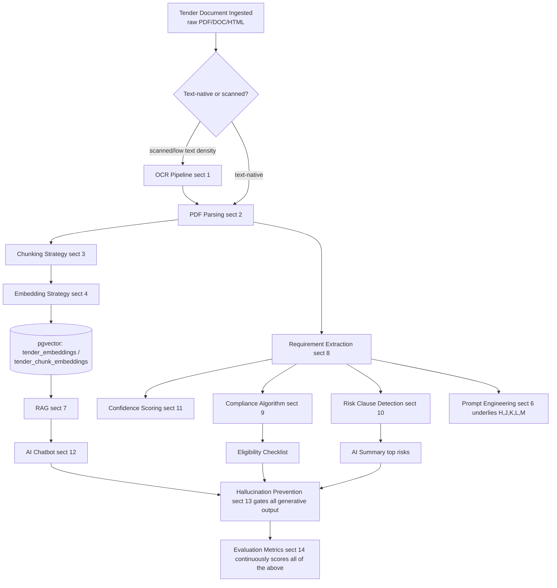

# TenderIQ — AI Pipeline Design

## Document Control

| Field | Value |
|---|---|
| Document | AI_DESIGN.md |
| Product | TenderIQ — AI Procurement Intelligence Platform for MSMEs |
| Version | 1.0 (Baseline) |
| Status | Approved — Authoritative Source of Truth for the AI Engine's internal pipeline |
| Owner | Chief Software Architect |
| Last Updated | 2026-07-30 |
| Owning Service | AI Engine (Python/FastAPI), internal-only — see [Architecture.md](../architecture/Architecture.md) §8, §9.2. Nothing in this document is directly reachable by a client; every capability described here is exposed to end users only through the Backend API endpoints in [API_SPEC.md](../api/API_SPEC.md) §9. |
| Related Documents | [Architecture.md](../architecture/Architecture.md) · [DATABASE.md](../database/DATABASE.md) · [API_SPEC.md](../api/API_SPEC.md) · [ENGINEERING_GUIDE.md](../engineering/ENGINEERING_GUIDE.md) |

> **Schema note (read before §4/§7):** Two tables referenced by this document — `tender_document_chunks` and `tender_chunk_embeddings` — implement chunk-level retrieval for RAG (§7) and are **not yet present in DATABASE.md v1.0**, which currently only defines a tender-level `tender_embeddings` table. This is an additive gap, not a contradiction: the RAG behavior was already specified in Architecture.md §9.2/§10.3 ("vector search within this tender's document chunks") without the supporting table ever being enumerated. Per this document set's own migration policy (DATABASE.md §12, additive/non-breaking), I am registering both tables as a DATABASE.md addendum in the same change that introduces this document, so the schema stays the single source of truth. See DATABASE.md §7.7 (Addendum) for the finalized column definitions.

> **Vector-store note (read before §5):** Architecture.md §8.1 committed to `pgvector` inside PostgreSQL as the one online vector store, to keep the operational surface minimal at MSME-appropriate cost (NFR-7). FAISS is included in this document per your request, but is scoped to **offline/experimentation use inside the AI Engine** (embedding-model evaluation, clustering for risk-clause peer comparison, §10) rather than as the live serving index — this keeps FAISS's inclusion consistent with the already-locked architecture instead of silently introducing a second production vector store. If you intend FAISS (or another engine) to replace `pgvector` as the *online* store, that is an architecture change and needs your explicit sign-off before I apply it.

---

## Pipeline Overview



---

## 1. OCR Pipeline

**Trigger**: a document is routed to OCR when PDF Parsing (§2) reports a text-layer character density below a configured threshold (near-zero extractable text = scanned/image-based PDF), or when a specific page within an otherwise text-native PDF is image-only (common for signed/stamped annexes).

**Stages**:

1. **Document classification** — a cheap heuristic pass (characters-per-page vs. page area) decides text-native vs. scanned *before* committing to the more expensive OCR path, so the majority of GeM/CPPP text-native tenders never touch OCR at all.
2. **Page rasterization** — scanned pages are rendered to images at a fixed target resolution (300 DPI baseline; escalated to 400 DPI on a low-confidence retry) to balance OCR accuracy against processing cost/latency.
3. **Layout-aware OCR** — the OCR engine preserves bounding boxes and reading order (not just a flat text dump), because tender documents carry meaning in tables (BOQ, eligibility-criteria tables) that a naive top-to-bottom text concatenation would scramble.
4. **Engine selection** — an open-source OCR engine (Tesseract-class) is the default, consistent with Architecture.md NFR-7 (cost-efficiency, open-source-first); pages that come back below a minimum OCR confidence are retried through a managed cloud OCR fallback before being accepted, rather than accepted at low quality.
5. **Post-OCR cleanup** — dehyphenation across line breaks, whitespace normalization, and removal of repeating headers/footers/page numbers (detected as near-identical lines recurring across most pages of the same document).
6. **Language detection** — tagged per document (English is the current supported language; non-English content is flagged rather than mistranscribed, pending the multi-language future scope in Architecture.md NFR-12).
7. **Per-page OCR confidence** — the engine's character-level confidence is averaged per page and persisted as the ceiling input to Confidence Scoring (§11); pages below the acceptance threshold after the cloud-fallback retry are marked `ocr_required`-failed and routed to the manual-review queue (feeding `ingestion_errors`, DATABASE.md §7.2) rather than silently accepted.

**Output**: plain text + layout metadata (page, bounding box, detected table regions) handed to PDF Parsing's downstream structuring step (§2) as if it were a text-native extraction — OCR and native-text paths converge into one common representation before chunking.

---

## 2. PDF Parsing

**Text-native extraction**: a layout-aware parser (not a flat `pdftotext`-style dump) produces a stream of typed blocks — paragraph, heading, table, list-item — each carrying position metadata (page, bounding box). This typed structure is what makes later clause-level citation (NFR-6) and table-aware chunking (§3) possible.

**Clause/section segmentation**: numbering-pattern detection (`1.`, `1.1`, `Section 3`, `Clause 4(a)`, `(i)`, `(ii)`) builds a hierarchical section tree for the document. This tree is the backbone for:
- Chunk boundaries (§3) that respect clause integrity.
- The `sourceClauseExcerpt` / `sourcePageNumber` citation fields shown to users (API_SPEC.md §9.1).

**Table extraction**: ruled and unruled tabular regions (BOQ line items, eligibility-criteria tables, required-document checklists) are detected and parsed into structured rows/columns, not flattened into prose — a table handed to extraction as structured data is dramatically more reliable than the same table read as run-on text.

**First-pass metadata anchors**: before any LLM call, cheap layout heuristics extract candidate values for the highest-value fields — tender number, issuing authority, key dates, EMD amount — by looking for labeled fields near their typical position (title block on page 1, a labeled row like "Last Date of Submission: ..."). These anchors are **candidates for the LLM extraction step (§8) to confirm or correct**, not final values; anchoring the LLM to a short list of candidates instead of a blank page measurably reduces both hallucination risk and token cost.

**Format normalization**: non-PDF inputs (`.doc`, `.docx`, and any image-only files delivered directly rather than embedded in a PDF) are converted to PDF before this stage runs, so exactly one parsing code path exists downstream.

**Failure handling**: a parse that yields near-empty structured output (after the OCR fallback has already been tried) marks `tender_documents.processing_status = failed` and writes an `ingestion_errors` row (DATABASE.md §7.2) rather than silently producing a partially-populated tender.

---

## 3. Chunking Strategy

**Chunking unit**: chunks are aligned to the clause/section tree from §2 — never a blind fixed-size sliding window that can cut a requirement mid-sentence. A chunk is defined as the smallest structural unit (a numbered clause, a sub-clause, or a table) that is still meaningful read in isolation, since a retrieved chunk must stand as a citable, self-contained unit for RAG (§7) and for the eligibility checklist's quoted excerpts (NFR-6).

**Sizing**:

| Rule | Value |
|---|---|
| Target chunk size | 300–500 tokens |
| Hard maximum before forced split | 800 tokens |
| Overlap on forced split (long clause split at a sentence boundary) | ~50 tokens |
| Table chunks | Kept as a single chunk regardless of the general max — a fragmented BOQ/eligibility table loses meaning when split row-by-row |

**Metadata per chunk** (persisted in `tender_document_chunks`, see schema note above): `tenderDocumentId`, `chunkIndex`, `sectionPath` (e.g. `"3 > 3.2 > (a)"`), `pageNumberStart`/`pageNumberEnd`, `tokenCount`, `contentHash`.

**Boilerplate deduplication**: many issuing authorities reuse near-identical standard terms-and-conditions boilerplate across dozens of tenders. Chunks are deduplicated via `contentHash` — an already-embedded boilerplate chunk is linked, not re-embedded — which materially reduces embedding volume and LLM/embedding API cost at scale (Architecture.md NFR-7, Risk R-4).

**Re-chunking triggers**: a document's chunks are generated once at ingestion and are immutable thereafter (documents themselves are immutable, DATABASE.md §5 Category B); re-chunking only happens if the document is explicitly re-processed (e.g., a corrected re-upload), never silently on read.

---

## 4. Embedding Strategy

**Two distinct embedding types**, sharing one model family so their vector spaces remain comparable:

| Type | Table | Cardinality | Regenerated When |
|---|---|---|---|
| Tender-level embedding | `tender_embeddings` (DATABASE.md §7.3) | 1 per tender | Tender re-extraction or a material field correction |
| Organization-profile embedding | `organization_profile_embeddings` (DATABASE.md §7.3) | 1 per organization | MSME profile or certification changes |
| Chunk-level embedding | `tender_chunk_embeddings` (addendum, see schema note above) | 1 per unique chunk (post-dedup, §3) | Once, at ingestion — immutable |

**Model**: a single embedding model family is used across all three (Voyage AI's retrieval-optimized embedding model, the provider Anthropic recommends alongside the Claude API used for generation — an additive detail Architecture.md left unspecified, not a change to the locked Claude-for-generation decision). Fixed at 1536 dimensions, matching the `vector(1536)` columns already defined in DATABASE.md.

**Normalization**: all embeddings are L2-normalized at generation time so cosine similarity reduces to a dot product, matching the cosine operator class used by `pgvector`'s `hnsw`/`ivfflat` indexes (DATABASE.md §10).

**Batching**: embeddings are generated in batches per ingestion run (not one API call per tender/chunk) to control call overhead and cost.

**Freshness/staleness**: a `match_scores.is_stale` flag (DATABASE.md §7.3) is set whenever the underlying tender or organization embedding changes, driving the asynchronous recompute queue (Architecture.md §9.2 Matching Engine) rather than serving a comparison against a stale vector.

---

## 5. FAISS

FAISS is used **offline, inside the AI Engine, for experimentation and analysis — not as the online serving index** (see the Vector-store note above; `pgvector` remains the one live store per Architecture.md §8.1). Concretely:

- **Embedding-model evaluation**: when a candidate embedding model/version is being evaluated (§14 Evaluation Metrics), a FAISS index is built over a held-out corpus to benchmark retrieval quality (recall@k, latency) before a model is ever promoted to the live `pgvector` tables — cheaper and faster to iterate on than standing up a parallel Postgres index for every candidate.
- **Peer-distribution clustering for Risk Clause Detection (§10)**: the statistical-outlier signal (comparing a tender's eligibility thresholds against same-category historical peers) is computed via an offline FAISS-backed similarity/clustering job over historical tender embeddings, run periodically (not per-request), with results cached back into `tenders`/`match_scores` metadata rather than queried live through FAISS.
- **Why not the live path**: FAISS is an in-process library with no native persistence/replication/access-control story suited to a multi-tenant, horizontally-scaled service (Architecture.md §14) — `pgvector` gives TenderIQ transactional consistency with the relational data it's always queried alongside (e.g., "similar tenders AND organization_id = X AND status = active" in one query) without a second system to keep in sync. FAISS's algorithms (IVF, HNSW, product quantization) are exactly what `pgvector`'s `ivfflat`/`hnsw` index types are modeled on, so the same conceptual indexing approach is used online without a second moving part.
- **Promotion path**: if embedding volume or query-latency data ever crosses the threshold documented in Architecture.md §18 (dedicated vector store migration), the offline FAISS harness described here is the same harness used to benchmark whether a dedicated online engine is actually justified — it is the evaluation tool for that future decision, not a pre-commitment to make it.

---

## 6. Prompt Engineering

**Design principles applied to every prompt template**:

1. **Role framing** — each prompt opens by scoping the model tightly to its task (e.g., "You are TenderIQ's extraction assistant. Only state facts present in the provided document.").
2. **Structured output enforcement** — extraction, eligibility, and risk-classification prompts require a fixed JSON schema as output (via the model provider's structured-output/tool-use mechanism), not free-form text later parsed with regex — this makes a missing field `null` by construction rather than an omission the caller has to infer.
3. **Explicit uncertainty instruction** — every extraction-shaped prompt instructs the model to return `null` plus a low confidence value when a field cannot be determined, and explicitly forbids inferring a plausible-sounding value.
4. **Embedded citation requirement** — any prompt whose output makes a factual claim (summary, eligibility, Q&A) requires the exact supporting sentence/clause and its page number alongside the claim, in the same schema, not as an afterthought.
5. **Few-shot anchoring** — extraction prompts include a small, curated set of gold-standard input→output examples, kept per-source-type (GeM-shaped vs. CPPP-shaped vs. state-portal-shaped) since document layout varies enough between sources that one universal example set under-serves several of them — mirroring the "one adapter per source" philosophy already used for ingestion connectors (Architecture.md §9.2).
6. **Context budgeting** — prompts operating over long documents (RAG, eligibility) are given only the retrieved/relevant chunks (§7), never the full document, to keep latency and cost bounded and predictable (NFR-2).
7. **Determinism by task** — extraction, compliance-checking, and risk-classification prompts run at low/zero sampling temperature for reproducibility; summary and draft-generation prompts run at a moderate temperature for natural phrasing, still bounded well short of "creative" settings.
8. **Versioning** — every prompt template carries a version identifier; a change to a template is a new version, never an in-place silent edit, so the Evaluation Metrics gate (§14) can compare exact template versions and a regression can be attributed and rolled back precisely.

Each task type below has its own template family, each independently versioned: **Extraction**, **Eligibility Checklist**, **AI Summary**, **RAG Q&A**, **Risk Clause Classification**, **Draft Generation**.

---

## 7. RAG (Retrieval-Augmented Generation)

**Used by**: Eligibility Checklist generation (§9), the AI Chatbot (§12), and as the context-assembly step for parts of Requirement Extraction (§8) that operate over long documents in chunks rather than the whole text at once.

**Retrieval scope**: strictly scoped to the single tender in question — the vector search predicate is always filtered on `tenderId`, both because cross-tender retrieval would produce factually wrong answers (a question about Tender A must never surface Tender B's clauses) and because it keeps latency bounded regardless of total corpus size.

**Retrieval algorithm — hybrid**:

1. **Dense retrieval**: top-k (~8) chunks by cosine similarity against `tender_chunk_embeddings` (§4), scoped to the tender.
2. **Sparse retrieval**: Postgres full-text search over chunk text for exact-term matches — procurement documents lean heavily on exact defined terms (`EMD`, `L1`, specific clause numbers) that dense embeddings alone can under-retrieve.
3. **Re-ranking**: the union of dense + sparse candidates (~20) is re-ranked by a weighted combination of similarity score and keyword-match score down to the final top-k context set; an optional cross-encoder re-rank is applied for ambiguous questions where the two signals disagree materially.
4. **Position-ordered context assembly**: the final chunks are injected into the prompt in their **original document order**, not score order — clause meaning frequently depends on the preceding/following clause, and score-order injection was found to produce less coherent grounding.

**Answer generation**: the LLM is instructed to answer strictly from the assembled context, attach a citation (chunk → document/page) to the answer, and — if no retrieved chunk clears a minimum similarity threshold — return a deterministic "not addressed in this document" response instead of attempting an answer from general knowledge (this rule is the backbone of §13 Hallucination Prevention).

---

## 8. Requirement Extraction

**Canonical extraction schema** (illustrative shape — final field list matches `tenders` + `eligibility_checklist_items` in DATABASE.md §7.2/§7.3):

```json
{
  "title": "string",
  "issuingAuthority": "string | null",
  "tenderValueAmount": "number | null",
  "emdAmount": "number | null",
  "submissionDeadlineAt": "ISO-8601 | null",
  "openingAt": "ISO-8601 | null",
  "locationState": "string | null",
  "locationCity": "string | null",
  "eligibilityCriteria": [
    {
      "criterionText": "string",
      "category": "turnover | certification | experience | geography | technical_capacity | other",
      "sourcePageNumber": "integer",
      "sourceClauseExcerpt": "string",
      "confidence": "number (0-1)"
    }
  ],
  "requiredDocuments": ["string"],
  "categoryTags": ["string"]
}
```

**Two-pass extraction**:

- **Pass 1 — Anchor extraction (deterministic/heuristic)**: the labeled-field and title-block heuristics from PDF Parsing (§2) produce fast, cheap, high-confidence candidates for dates, amounts, and category tags.
- **Pass 2 — LLM structured extraction**: an LLM call over the relevant chunks (full document for shorter tenders; retrieved/most-relevant chunks for long ones, per the context-budgeting principle in §6) produces the full schema above, using Pass 1's candidates as anchors to confirm, correct, or supersede — the LLM is explicitly told which fields Pass 1 already proposed and asked to agree or override with justification, rather than starting from a blank document with no prior.

**Cross-validation**: Pass 1 and Pass 2 values for the same field are compared; agreement raises the field's confidence, disagreement lowers it and routes the field to the manual-review queue and to `tender_field_corrections` once a human or a later re-extraction resolves it (DATABASE.md §7.2, NFR-6).

**Eligibility criteria enumeration**: the model is required to output each distinct qualification/eligibility clause as its own array entry (never merged into one paragraph) and to tag it with a fixed category — this categorization is what makes the deterministic Compliance Algorithm (§9) possible, since only categorized, atomic criteria can be mapped to a specific rule.

**Required-documents enumeration**: similarly extracted as a discrete checklist array, which seeds `checklist_tasks` (DATABASE.md §7.4) the moment a user shortlists the tender into their pipeline (FR-BID-1).

**Source-format resilience**: extraction prompts are parameterized per `tenderSourceId` (few-shot examples specific to GeM-shaped vs. CPPP-shaped vs. state-portal-shaped documents), rather than relying on one universal prompt across structurally different source formats.

---

## 9. Compliance Algorithm

A **deterministic rule engine** runs over the categorized, extracted eligibility criteria (§8) and the requesting organization's `msme_profiles` + `msme_certifications` (DATABASE.md §7.1) to produce each `eligibility_checklist_items.status`.

| Criterion Category | Evaluation Logic |
|---|---|
| `turnover` | An LLM-assisted sub-extraction parses the clause into `{ thresholdAmount, currency, windowYears, aggregation: avg \| each_year }`; the resulting structured threshold is then compared **deterministically** (plain numeric comparison, no LLM involved at comparison time) against `msme_profiles.annualTurnoverYear1/2/3Amount`. |
| `certification` | Exact match against `msme_certifications.certificateType` (+ `expiresAt` validity check), with a maintained synonym/alias table for common textual variants (e.g. "ISO 9001:2015" vs. "ISO-9001") as a fuzzy-match fallback before falling back to `needs_verification`. |
| `experience` | Compares `msme_profiles.yearsInOperation` and/or the organization's own `pipeline_items` history (prior wins in a similar category) against the stated minimum years/similar-project requirement. |
| `geography` | Matches the tender's `locationState`/`locationCity` (or explicit geographic-restriction text) against `msme_profiles.preferredLocations`. |
| `technical_capacity` / `other` | Not deterministically evaluable from structured profile data (e.g., "must have executed a similar-scope project") — **always** returned as `needs_verification`, never auto-marked `met`, since a false "met" is a strictly worse failure mode than asking the user to confirm (Risk R-2, R-6). |

**Output**: each item's `status` plus a human-readable reasoning string (e.g., "Your turnover: ₹42,00,000 vs. required: ₹50,00,000") stored alongside the checklist item so a user sees *why*, not just a verdict — never a bare pass/fail with no explanation.

**Feed into Match Score**: the fraction of mandatory criteria evaluated `met` feeds `match_scores.ruleBasedScore` directly, and a hard `not_met` on a mandatory criterion caps the overall Match Score at a low ceiling regardless of how semantically similar the tender is — preventing a tender that "reads similar" from scoring artificially high when the organization is plainly ineligible.

---

## 10. Risk Clause Detection

**Purpose** (FR-AI-6): flag tenders whose clauses are abnormally restrictive relative to peers ("tailored tender" pattern, often indicating the tender was scoped around an incumbent bidder) or that carry elevated commercial/legal risk for a new bidder — unlimited liability, one-sided termination rights, unusually short EMD-forfeiture windows, short-notice mandatory site visits, disproportionate penalty clauses.

**Two complementary signals**:

1. **Statistical peer-outlier detection**: each tender's key numeric thresholds (turnover-multiple-vs.-tender-value, required years of experience, EMD as a percentage of tender value) are compared against the distribution of same-category historical tenders, computed via the offline FAISS-backed clustering job (§5). A threshold beyond roughly the 90th percentile for its category is flagged as "restrictive relative to peers," with the percentile and comparison set shown to the user.
2. **LLM clause classification**: a dedicated, low-temperature classification prompt evaluates each extracted eligibility/terms clause against a fixed risk-clause taxonomy (`unlimited_liability`, `one_sided_termination`, `narrow_eligibility_window`, `excessive_penalty`, `non_standard_payment_terms`), returning a severity (`low`/`medium`/`high`) and the supporting excerpt for any clause it flags.

**Surfacing**: flagged risks appear as the "top risks" component of the AI Summary (FR-AI-4) and as explicit, individually-citable flags on the tender detail response — never buried in prose only.

**Advisory, not blocking**: risk flags never prevent a user from shortlisting or proceeding with a tender (mirroring Match Score's advisory-only status, Risk R-6) — each flag carries its reasoning so a bid manager can dismiss one they judge inapplicable to their situation.

---

## 11. Confidence Scoring

Each extracted field carries a confidence value (0.00–1.00), rolled up into `tenders.extractionConfidenceOverall` (DATABASE.md §7.2), computed from four inputs:

| Input | Effect |
|---|---|
| Pass 1 / Pass 2 agreement (§8) | Full agreement → high confidence; disagreement → low confidence, both raw values retained via `tender_field_corrections`. |
| Model's self-reported uncertainty | Required as part of the structured extraction schema (§8); treated as one signal among several, never trusted alone. |
| OCR confidence ceiling (§1) | A field extracted from a low-OCR-confidence page can never score above that page's OCR confidence, regardless of how confident the LLM sounds — the underlying text itself may be wrong. |
| Source-format familiarity | A `tenderSourceId` with a strong history of successful extractions contributes a small positive prior; a newly onboarded source contributes a small negative prior until enough volume accrues. |

**Thresholds**: fields below a configured cutoff (default 0.6) are surfaced in the UI as "needs verification," never presented with the same visual weight as a confirmed fact, and are prioritized in the ops manual-review queue (US-11).

**Aggregation weighting**: `extractionConfidenceOverall` is a weighted average that favors the fields most consequential to the user — `submissionDeadlineAt` and eligibility criteria are weighted higher than, e.g., `locationCity`.

---

## 12. AI Chatbot

Two clearly separated modes — deliberately kept apart so a user can never mistake a general help answer for a grounded tender fact:

1. **Tender-scoped chatbot** (FR-AI-5, API_SPEC.md §9.2) — grounded strictly in one tender's chunks via RAG (§7). Session-scoped conversation history (last few turns) is included for natural follow-ups ("what about the EMD?"), but history never carries across a change of tender or organization — switching context starts a fresh conversation.
2. **Platform-help chatbot** — answers "how do I..." questions about using TenderIQ itself, grounded only in a small, fixed TenderIQ help-content knowledge base, never in any tender or organization data.

**Refusal behavior**: the tender-scoped chatbot declines rather than speculates on questions outside its grounding — e.g., "what's my chance of winning this?" is redirected to the Match Score feature rather than answered from the model's general sense of things; questions shaped like a request for legal advice ("is this clause enforceable?") receive a standard disclaimer directing the user to professional counsel, never a definitive legal opinion.

**Latency budget**: targets the same p95 ≤ 8s ceiling as AI Summary generation (Architecture.md NFR-2), achieved by a single retrieval-then-generate pass — no multi-step agentic loop for this feature, keeping behavior fast and predictable.

---

## 13. Hallucination Prevention

A layered set of controls, none relied upon alone:

1. **Grounding-only prompt instruction** (§6) on every generative prompt, reinforced with few-shot examples that explicitly demonstrate the desired refusal ("not specified in this document") rather than only demonstrating successful extraction.
2. **Structured-output enforcement** (§6, §8) makes free-form speculative prose mechanically harder to produce in place of a factual field — a field the model cannot support from the document must be `null`, not a plausible guess.
3. **Citation-or-null validation**: every factual claim (eligibility status, summary fact, chatbot answer) must carry a document/page citation in the same schema it's generated in; a lightweight validation step on the AI Engine's own output rejects and regenerates (or falls back to "needs verification") any response that makes a claim without a citation — this is enforced in code on the output, not left to prompt compliance alone.
4. **Retrieval-threshold gating** (§7): if no retrieved chunk clears the minimum similarity threshold for a tender-scoped question, the system deterministically returns "not addressed in this document" rather than ever sending an under-grounded question through to open-ended generation.
5. **Confidence-linked UI treatment** (§11): any output below the confidence threshold is visually distinguished as "needs verification" rather than presented with the same weight as a confirmed fact — hallucination risk is treated as a UX/disclosure problem, not solely a model-quality problem.
6. **Human-in-the-loop for consequential outputs**: draft-generation output and any AI-proposed field correction always require explicit human review/action before being treated as final (Architecture.md §9.2 Draft Generation Service, FR-BID-2) — the system's worst-case failure mode for a hallucination is "flagged for review," never "silently acted upon."
7. **Periodic adversarial testing**: extraction/eligibility/chatbot prompts are regularly evaluated against a held-out set of deliberately ambiguous or edge-case tender documents (conflicting dates, ambiguous clause references, mixed-language sections) as part of the evaluation cadence (§14); a regression on this set blocks promoting a new prompt/model version to production.

---

## 14. Evaluation Metrics

| Metric | What It Measures | Method |
|---|---|---|
| Field-level extraction precision/recall/F1 | Extraction accuracy (§8), weighted toward high-impact fields (`submissionDeadlineAt`, eligibility criteria) | Scored against a stratified, human-labeled gold set of tenders spanning all onboarded sources. |
| Eligibility-status agreement | Compliance Algorithm + extraction correctness combined (§9) | Cohen's kappa between AI-assigned `met`/`not_met`/`needs_verification` and human reviewer judgment on a sampled set. |
| RAG/chatbot groundedness | Whether an answer follows strictly from its cited chunk (§7, §12, §13) | LLM-as-judge rubric scoring groundedness + citation-precision (fraction of citations that actually support the claim they're attached to), run against a held-out Q&A set of anonymized real questions plus synthetic adversarial questions. |
| Match Score calibration | Whether the Match Score actually predicts win/loss (§9, FR-BID-3) | Calibration curve: predicted-score bucket vs. observed win rate, tracked over time; recalibration triggers if buckets drift beyond a defined tolerance. |
| Confidence calibration | Whether stated confidence (§11) matches observed correctness | Reliability diagram — an 80%-confidence field should be correct ~80% of the time; miscalibration triggers threshold retuning. |
| Operational metrics | Pipeline health (Architecture.md §16) | Extraction latency, OCR-fallback rate, manual-correction rate (US-11), AI-credit cost per tender processed, chatbot refusal rate (tracked as both a safety signal and a coverage-gap signal — a rising refusal rate on legitimate questions points at a retrieval/chunking problem, not just appropriate caution). |

**Release gate**: a new prompt template version or embedding/model version is promoted from staging to production only after it meets or exceeds the current production version on **every** metric above, evaluated against the same fixed eval set — no "average improvement" promotion that tolerates a regression on any individual metric.

---

## 15. Future Improvements

- **Fine-tuned/smaller extraction model** for the highest-volume, most-structured extraction tasks, reserving the larger Claude model for chatbot and draft-generation tasks where language quality matters most — reduces per-tender AI cost at scale (Risk R-4).
- **Active-learning loop**: automatically curate human corrections (`tender_field_corrections`) into the gold evaluation set and the few-shot example pool, closing the loop between production corrections and prompt/model improvement.
- **Multi-language extraction and chatbot support** (Hindi and regional languages), per Architecture.md NFR-12/§18.
- **Cross-tender risk-pattern learning**: move Risk Clause Detection's statistical signal (§10) from percentile-based peer comparison toward a model trained on actual disqualification/win-loss outcomes, to better separate genuinely risky clauses from boilerplate language that merely looks unusual.
- **Table-structure-aware extraction upgrade**: a dedicated table-structure model for complex BOQ tables, reducing reliance on the layout heuristics in §2.
- **Streaming chatbot responses and iterative/agentic retrieval** (query reformulation, multi-hop retrieval) for harder multi-part questions, once the latency budget (§12) is deliberately relaxed for that use case.
- **Dedicated online vector store migration path**: if embedding volume or query latency crosses the threshold documented in Architecture.md §18, the offline FAISS harness (§5) is the benchmark tool used to decide — and justify — that migration, rather than a decision made speculatively today.
