# TenderIQ — System Architecture

## Document Control

| Field | Value |
|---|---|
| Document | Architecture.md |
| Product | TenderIQ — AI Procurement Intelligence Platform for MSMEs |
| Version | 1.0 (Baseline) |
| Status | Approved — Authoritative Source of Truth |
| Owner | Chief Software Architect |
| Last Updated | 2026-07-30 |
| Change Policy | This architecture MUST NOT be altered without explicit authorization. All future documents (database, API, AI pipeline, engineering standards) must remain consistent with this document. |
| Related Documents | [DATABASE.md](../database/DATABASE.md) · [API_SPEC.md](../api/API_SPEC.md) · [AI_DESIGN.md](../ai/AI_DESIGN.md) · [ENGINEERING_GUIDE.md](../engineering/ENGINEERING_GUIDE.md) |

---

## 1. Vision

Micro, Small, and Medium Enterprises (MSMEs) lose access to public and private procurement opportunities not because they are unqualified, but because **discovering, understanding, and qualifying for tenders is manual, fragmented, and expertise-intensive**. Tenders are published across dozens of disconnected portals (GeM, CPPPP, state e-procurement portals, PSU portals, private aggregators), each publishing dense, unstructured PDF/HTML documents with inconsistent formats. An MSME owner without a dedicated bid desk cannot realistically track, read, and evaluate more than a fraction of the opportunities they are eligible for.

**TenderIQ's vision** is to become the AI-powered procurement co-pilot for MSMEs: a single platform that continuously ingests tenders from every relevant source, uses AI to read and structure each tender the way a skilled bid manager would, matches opportunities against an MSME's real eligibility profile, scores their win-worthiness, and guides them from discovery to submission — collapsing what today takes days of manual research into minutes.

The platform is built to be:

- **Inclusive** — affordable and usable by a business with no dedicated procurement staff.
- **Trustworthy** — every AI-derived claim (eligibility, deadline, value) is traceable back to the source document.
- **Actionable** — not just a search engine, but a workflow tool that moves a user from "tender found" to "bid submitted."
- **Scalable as a system of record** — as an MSME's tender history grows, TenderIQ becomes their institutional memory of past bids, outcomes, and win patterns.

---

## 2. Functional Requirements

Requirements are grouped by module and numbered `FR-<MODULE>-<N>` for traceability into API_SPEC.md and test plans.

### 2.1 Identity, Organizations & Access (IAM)

| ID | Requirement |
|---|---|
| FR-IAM-1 | Users register and authenticate via email/password or OAuth (Google). |
| FR-IAM-2 | A user belongs to one or more **Organizations** (an MSME's tenant workspace). |
| FR-IAM-3 | Organizations support role-based membership: `Owner`, `Bid Manager`, `Viewer`. |
| FR-IAM-4 | Organization Owners can invite, remove, and change the role of members. |
| FR-IAM-5 | Every organization maintains an **MSME Profile**: industry sector(s), NIC/NIC codes, Udyam registration, GST number, PAN, annual turnover bands (last 3 years), years in operation, certifications (ISO, MSE, startup recognition), past experience/work completed, empanelments, and preferred geographies. |
| FR-IAM-6 | Session management via short-lived access tokens + rotating refresh tokens; sessions are revocable per-device. |

### 2.2 Tender Ingestion & Normalization

| ID | Requirement |
|---|---|
| FR-ING-1 | The system continuously ingests tenders from configured sources (GeM, CPPP, state e-procurement portals, PSU portals, private aggregators) via scheduled scrapers/connectors. |
| FR-ING-2 | Each ingested tender is deduplicated against existing records using a source-id + fuzzy content hash strategy. |
| FR-ING-3 | Raw tender documents (PDF, DOC, HTML) are stored immutably in object storage and linked to the tender record. |
| FR-ING-4 | The AI Engine extracts structured fields from raw documents: tender title, issuing authority, tender value, EMD amount, submission deadline, opening date, eligibility criteria, required documents, category/NIC codes, and location. |
| FR-ING-5 | Ingestion failures (unparseable documents, source downtime) are logged and retried with backoff, and surfaced on an internal ingestion-health dashboard. |
| FR-ING-6 | Ingested tenders pass through a normalization pipeline that maps source-specific categories to TenderIQ's canonical taxonomy. |

### 2.3 AI Matching & Scoring

| ID | Requirement |
|---|---|
| FR-AI-1 | Each tender is embedded (vector representation) and semantically indexed for similarity search. |
| FR-AI-2 | For every active organization, the system computes a **Match Score (0–100)** per relevant tender based on sector fit, turnover eligibility, certification requirements, geography, and historical win pattern. |
| FR-AI-3 | The system computes an **Eligibility Checklist** per tender per organization, marking each stated eligibility criterion as Met / Not Met / Needs Verification, with the source clause quoted. |
| FR-AI-4 | The system generates a plain-language **AI Summary** of every tender (scope, key dates, value, top 3 risks/requirements). |
| FR-AI-5 | Users can ask natural-language questions about a specific tender ("Do I need ISO certification for this?") and receive answers grounded in the tender document (RAG). |
| FR-AI-6 | The system flags tenders with abnormally restrictive or non-standard clauses ("tailored tender" detection) that may indicate low win probability for new bidders. |

### 2.4 Discovery, Search & Alerts

| ID | Requirement |
|---|---|
| FR-DIS-1 | Users can search tenders by keyword, category, location, value range, and deadline window, combining full-text and semantic search. |
| FR-DIS-2 | Users can filter to "Recommended for you" (Match Score ≥ configurable threshold). |
| FR-DIS-3 | Users can save search filters as persistent **Alerts**; new matching tenders trigger a notification (email, in-app, WhatsApp — future scope). |
| FR-DIS-4 | Users can bookmark/shortlist tenders into personal or organization-wide **Pipelines** (Watching, Preparing, Submitted, Won, Lost). |

### 2.5 Bid Preparation Workspace

| ID | Requirement |
|---|---|
| FR-BID-1 | For a shortlisted tender, users get an auto-generated **Document Checklist** (from FR-AI-3) they can assign to team members and mark complete. |
| FR-BID-2 | The AI Engine can draft boilerplate response sections (company profile, technical capability statement) pre-filled from the MSME Profile, for user review and edit — never auto-submitted. |
| FR-BID-3 | Users can log the outcome of a bid (Submitted, Won, Lost, Disqualified) with notes; this feeds back into match-score calibration (FR-AI-2). |
| FR-BID-4 | Deadline reminders are sent at configurable intervals (7 days, 3 days, 1 day, submission day). |

### 2.6 Analytics & Reporting

| ID | Requirement |
|---|---|
| FR-ANL-1 | Organization dashboard shows: tenders tracked, win rate, upcoming deadlines, pipeline funnel, and value of tenders won vs. bid. |
| FR-ANL-2 | Platform admins have an operational dashboard: ingestion volume/health, AI processing latency, active organizations, subscription metrics. |

### 2.7 Subscription & Billing

| ID | Requirement |
|---|---|
| FR-SUB-1 | The platform offers tiered plans (Free, Starter, Growth, Enterprise) gating tender-alert volume, AI-credit usage (summaries, Q&A, draft generation), and number of seats. |
| FR-SUB-2 | Billing integrates with a third-party payment gateway (Razorpay) supporting Indian payment methods; invoices are generated per billing cycle. |
| FR-SUB-3 | Usage against AI credits and alert quotas is metered in near-real-time and enforced at the API layer. |

### 2.8 Notifications

| ID | Requirement |
|---|---|
| FR-NOT-1 | Notifications are delivered via in-app feed and email at minimum, with channel preference per user. |
| FR-NOT-2 | All notification-worthy events (new match, deadline approaching, checklist item overdue, teammate action) are emitted as domain events and routed through a single notification service. |

---

## 3. Non-Functional Requirements

| ID | Category | Requirement |
|---|---|---|
| NFR-1 | Availability | Core read paths (search, browse, dashboard) target **99.5%** monthly uptime; ingestion/AI pipelines target **99%** (best-effort, non-blocking of reads). |
| NFR-2 | Performance | API p95 latency ≤ 300ms for CRUD/search endpoints (excluding AI-generation endpoints); AI summary generation ≤ 8s p95; tender search ≤ 500ms p95 at 100k active tenders. |
| NFR-3 | Scalability | System scales horizontally to 50,000 organizations and 2M ingested tenders without architectural change; stateless services scale independently per load. |
| NFR-4 | Security | All data encrypted in transit (TLS 1.2+) and at rest (AES-256); PII (GST, PAN, contact info) access is role-gated and audit-logged. |
| NFR-5 | Multi-tenancy | Strict logical tenant isolation — no organization can access another organization's data under any code path; enforced at the data-access layer, not only application logic. |
| NFR-6 | Data Integrity | AI-extracted fields are always traceable to source document + page/clause; corrections are versioned, never silently overwritten. |
| NFR-7 | Cost Efficiency | Infrastructure choices favor pay-as-you-scale, open-source-first components appropriate to an MSME-priced product; no per-seat enterprise-only dependencies in the core path. |
| NFR-8 | Maintainability | Services follow one coding standard (ENGINEERING_GUIDE.md); each service is independently deployable and independently testable. |
| NFR-9 | Observability | Every request is traceable end-to-end via correlation ID across API, AI Engine, and async workers. |
| NFR-10 | Portability | The system is cloud-portable: containerized services with no hard dependency on a single cloud vendor's proprietary managed service where a portable equivalent exists. |
| NFR-11 | Compliance | Handling of GST/PAN/financial data aligns with India's DPDP Act, 2023 obligations (consent, purpose limitation, breach notification readiness). |
| NFR-12 | Localization Readiness | Data model and frontend are structured to support multi-language (English + regional languages) without schema rework (Future Scope, Section 18). |

---

## 4. User Personas

### Persona 1 — Priya, MSME Owner (Primary)
- Runs a 25-person manufacturing/services business. Wears multiple hats; procurement is 10% of her time.
- Goal: find tenders she's actually eligible for without reading 40-page PDFs.
- Pain: misses deadlines buried in long documents; has been disqualified before for missing a document she didn't know was required.
- Technical comfort: low-to-medium; uses WhatsApp and mobile browser heavily.

### Persona 2 — Rahul, Dedicated Bid Manager
- Employed by a larger MSME (80–150 employees) specifically to track and respond to tenders.
- Goal: maximize submission volume and win rate; needs a pipeline view and team task assignment.
- Pain: juggles multiple portals and spreadsheets; no single source of truth on bid status.
- Technical comfort: medium-high; power user of filters, alerts, and exports.

### Persona 3 — Anita, Procurement Consultant
- External consultant serving multiple MSME clients.
- Goal: manage several organizations' pipelines from one login; demonstrate ROI to clients.
- Pain: context-switching between client accounts; needs client-specific eligibility profiles kept separate.
- Technical comfort: high.

### Persona 4 — Platform Operations Admin (Internal)
- TenderIQ's internal ops/support engineer.
- Goal: monitor ingestion health, AI pipeline accuracy, subscription metrics; triage failed ingestions and user-reported errors.
- Technical comfort: high (internal tooling user).

### Persona 5 — Vikram, Enterprise Compliance Officer (Enterprise tier)
- At larger MSME/small-enterprise clients, responsible for ensuring only compliant bids go out.
- Goal: approval workflows, audit trail of who changed what before submission.
- Pain: needs assurance no bid is submitted without sign-off.
- Technical comfort: medium.

---

## 5. User Stories

### 5.1 Priya (MSME Owner)

| ID | Story | Acceptance Criteria |
|---|---|---|
| US-1 | As Priya, I want to see only tenders relevant to my business so I don't waste time screening irrelevant ones. | Dashboard default view is filtered to Match Score ≥ 60; score and top match reasons are visible on each card. |
| US-2 | As Priya, I want a plain-language summary of a tender before opening the full PDF. | Every tender detail page shows an AI Summary above the raw document viewer, generated within 8s of first request. |
| US-3 | As Priya, I want to know if I'm missing any eligibility requirement before I invest time preparing a bid. | Eligibility Checklist shows Met/Not Met/Needs Verification with the exact clause quoted for each item. |
| US-4 | As Priya, I want to be reminded before deadlines so I never miss one again. | Reminders fire at 7/3/1 days and on submission day via email + in-app, configurable per organization. |

### 5.2 Rahul (Bid Manager)

| ID | Story | Acceptance Criteria |
|---|---|---|
| US-5 | As Rahul, I want a pipeline board of all tenders my team is tracking. | Kanban view with stages Watching → Preparing → Submitted → Won/Lost; drag-and-drop updates status and logs an audit event. |
| US-6 | As Rahul, I want to assign checklist items to teammates. | Checklist items support assignee + due date; assignee receives a notification. |
| US-7 | As Rahul, I want to export my pipeline and win/loss history for management reporting. | CSV/PDF export of pipeline and analytics available from the dashboard. |

### 5.3 Anita (Consultant)

| ID | Story | Acceptance Criteria |
|---|---|---|
| US-8 | As Anita, I want to switch between client organizations from one account. | Organization switcher in the top nav; all data scoped strictly to the active organization. |
| US-9 | As Anita, I want each client's eligibility profile kept private from other clients. | No cross-organization data leakage verified by tenant-isolation test suite (NFR-5). |

### 5.4 Ops Admin

| ID | Story | Acceptance Criteria |
|---|---|---|
| US-10 | As an Ops Admin, I want to see which ingestion sources are failing so I can fix connectors quickly. | Ingestion Health dashboard shows per-source success rate, last successful run, and error samples over the last 24h. |
| US-11 | As an Ops Admin, I want to see AI extraction confidence trends to catch model drift. | Dashboard tracks % of tenders requiring manual field correction, trended weekly. |

### 5.5 Vikram (Compliance Officer)

| ID | Story | Acceptance Criteria |
|---|---|---|
| US-12 | As Vikram, I want to require approval before a bid is marked Submitted. | Enterprise-tier organizations can enable an approval gate; status change to Submitted requires an Owner/designated approver action, logged in the audit trail. |

---

## 6. Business Workflow

End-to-end lifecycle of a tender through the platform, from discovery to outcome:

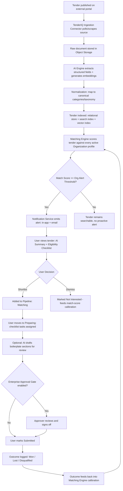

---

## 7. C4 Architecture

### 7.1 Level 1 — System Context

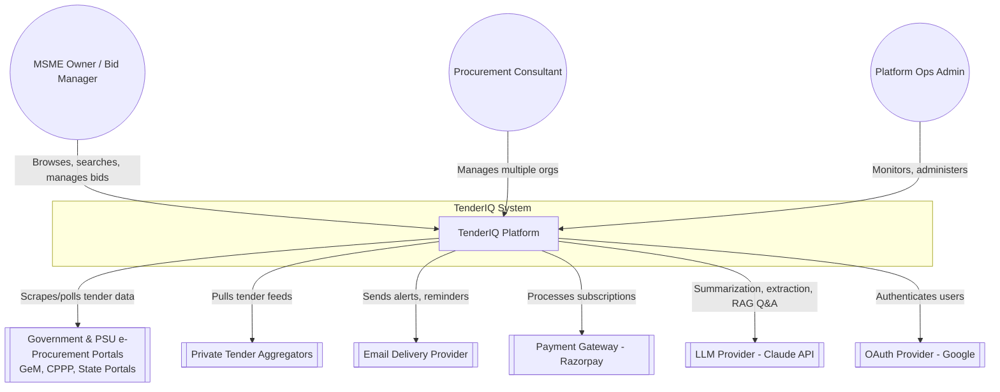

### 7.2 Level 2 — Container Diagram

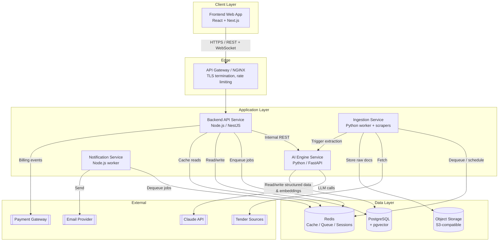

### 7.3 Level 3 — Component Diagram (Backend API Service)

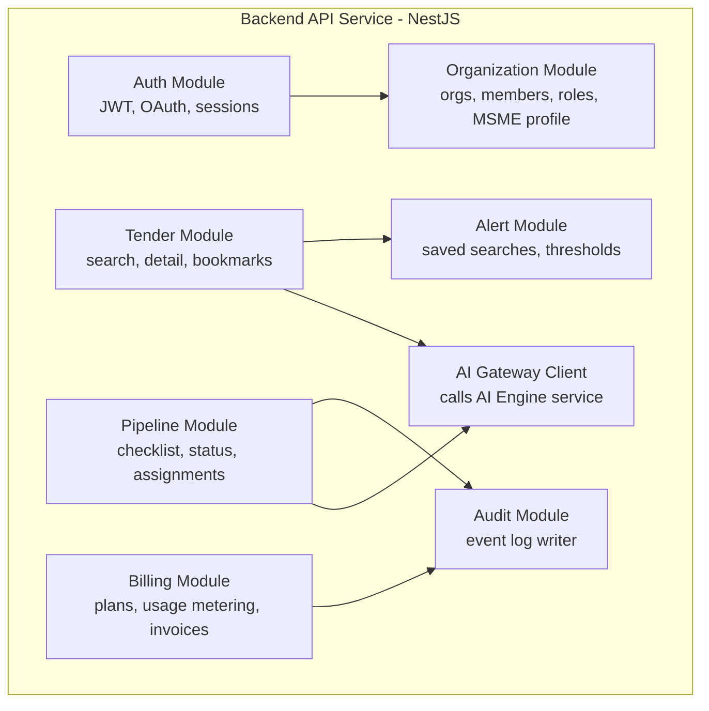

---

## 8. High Level Design

### 8.1 Technology Stack

| Layer | Technology | Rationale |
|---|---|---|
| Frontend | React + Next.js (TypeScript), TailwindCSS | SSR for fast first paint on tender listing pages, strong ecosystem, SEO-friendly for public tender pages. |
| Backend API | Node.js + NestJS (TypeScript) | Structured, modular, testable; shared TypeScript types with frontend; strong fit for I/O-bound orchestration. |
| AI Engine | Python + FastAPI | Native fit for NLP/ML tooling, document parsing, embeddings, LLM orchestration. |
| Primary Database | PostgreSQL + `pgvector` extension | Single relational store handling both transactional data and vector similarity search — avoids operating a separate vector database at MSME-appropriate cost/scale (NFR-7). |
| Full-Text Search | PostgreSQL native full-text search (initial); OpenSearch (future scope at scale) | Keeps operational surface minimal at launch; documented upgrade path in Section 18. |
| Cache / Queue | Redis (+ BullMQ for job queues) | Single technology serving caching, session storage, rate-limit counters, and async job queues. |
| Object Storage | S3-compatible storage (AWS S3 in prod, MinIO in local/dev) | Portable interface (NFR-10); stores raw tender documents immutably. |
| LLM Provider | Claude API (Anthropic) | Summarization, structured extraction, RAG Q&A, draft generation — see AI_DESIGN.md. |
| Containerization | Docker; Docker Compose (dev), Kubernetes (staging/prod) | Consistent environments across dev/CI/prod (NFR-10). |
| CI/CD | GitHub Actions | Test, lint, build, containerize, deploy pipeline per service. |
| Observability | OpenTelemetry, Prometheus, Grafana, centralized log aggregation (Loki) | See Sections 15–16. |

### 8.2 Service Responsibilities

| Service | Responsibility | Owns Data |
|---|---|---|
| **Frontend Web App** | Renders all user-facing UI; no business logic beyond presentation/validation. | None (stateless) |
| **Backend API Service** | Auth, organizations, tender CRUD/search orchestration, pipeline/checklist, alerts, billing, audit logging. Single point of truth for API contract (API_SPEC.md). | Users, Organizations, Memberships, Pipelines, Checklists, Alerts, Subscriptions, Audit Log |
| **AI Engine Service** | Document parsing (OCR where needed), field extraction, embeddings generation, match scoring, eligibility checklist generation, AI summaries, RAG Q&A, draft generation. Internal service, not exposed to the public internet. | Tenders (structured), Extraction metadata, Embeddings, Match Scores |
| **Ingestion Service** | Scheduled/queued scraping and polling of external tender sources; deduplication; raw document storage; triggers AI Engine extraction. | Raw source records, ingestion run logs |
| **Notification Service** | Consumes domain events, renders and dispatches notifications across channels. | Notification delivery log |

### 8.3 Design Principles

1. **Single source of truth per data domain** — one service owns writes to a data domain; other services read via API, never by reaching into another service's database directly.
2. **AI Engine is internal-only** — never directly exposed to the client; all client-facing AI features are proxied and rate-limited through the Backend API, which also enforces billing/credit checks.
3. **Async by default for anything AI or scraping related** — ingestion and AI extraction are queue-driven, never in the synchronous request path of a user-facing API call.
4. **Traceability of AI output** — every AI-derived field stores a reference to source document, page, and (where applicable) the extracted clause text, per NFR-6.

---

## 9. Low Level Design

> Full entity/attribute-level detail lives in [DATABASE.md](../database/DATABASE.md); full endpoint contracts live in [API_SPEC.md](../api/API_SPEC.md); AI pipeline internals live in [AI_DESIGN.md](../ai/AI_DESIGN.md). This section defines the module boundaries and internal contracts those documents must conform to.

### 9.1 Backend API — Module Breakdown

- **Auth Module**: issues access (short-lived, ~15 min) + refresh (rotating, ~30 days, revocable) JWTs; OAuth callback handling; password hashing (argon2id); device/session registry in Redis.
- **Organization Module**: CRUD on Organization + MSME Profile; membership invitation flow (tokenized email invite); role enforcement middleware applied to every organization-scoped route.
- **Tender Module**: read-heavy; delegates search to combined Postgres FTS + pgvector similarity query; delegates AI Summary/Q&A calls to AI Engine via internal REST with response caching in Redis (TTL 24h, invalidated on tender re-processing).
- **Pipeline Module**: state machine `Watching → Preparing → Submitted → {Won, Lost, Disqualified}`; illegal transitions rejected; every transition writes an Audit Module event; Enterprise approval gate implemented as a guard clause before `Submitted` transition.
- **Alert Module**: stores saved-search definitions; a scheduled job (not request-path) evaluates alerts against newly ingested/scored tenders and enqueues notification jobs.
- **Billing Module**: plan/entitlement definitions in code (not DB) for v1 simplicity; usage counters in Redis with periodic flush to Postgres for durability; Razorpay webhook handler for subscription lifecycle events.
- **Audit Module**: append-only event writer; every mutating action across modules calls `AuditService.record(actor, action, entity, before, after)`.

### 9.2 AI Engine — Module Breakdown

- **Ingestion Adapter Layer**: one adapter per source (GeM, CPPP, state portal, aggregator) implementing a common `SourceConnector` interface (`fetchNew()`, `fetchDocument()`, `mapToCanonical()`). New sources are added by implementing this interface only — no changes to downstream pipeline.
- **Document Parser**: PDF/DOC/HTML text extraction; OCR fallback (for scanned PDFs) via an OCR library; output is normalized plain text + layout metadata.
- **Extraction Pipeline**: LLM-driven structured extraction against a fixed JSON schema (title, authority, value, EMD, dates, eligibility criteria list, required documents list, category). Extraction confidence per field is stored; low-confidence fields are flagged for human review.
- **Embedding Pipeline**: generates a vector embedding per tender (summary + key fields) stored in `pgvector`; also embeds each Organization's MSME Profile for similarity-based matching.
- **Matching Engine**: hybrid scoring — a deterministic rules component (hard eligibility filters: turnover, certification, geography) combined with a semantic-similarity component (embedding cosine similarity) and a learned calibration weight adjusted from historical win/loss outcomes (FR-BID-3).
- **RAG Q&A Service**: retrieves the relevant tender document chunk(s) via vector search scoped to the single tender in question, then answers strictly grounded in retrieved content, refusing to answer outside that scope.
- **Draft Generation Service**: template-driven generation using MSME Profile fields + tender requirements; always returns a draft object requiring explicit user review — never a final/submittable artifact.

### 9.3 Internal API Contract (Backend ↔ AI Engine)

Internal-only, not exposed publicly; secured via a shared service-to-service token and restricted network policy (Section 13).

| Endpoint | Purpose |
|---|---|
| `POST /internal/tenders/{id}/extract` | Trigger/re-trigger structured extraction for a tender. |
| `GET /internal/tenders/{id}/summary` | Retrieve (or generate + cache) AI summary. |
| `POST /internal/tenders/{id}/qa` | RAG question answering scoped to one tender. |
| `POST /internal/orgs/{id}/match` | Compute/refresh match scores for an organization against active tenders. |
| `POST /internal/tenders/{id}/draft` | Generate a draft response section given org profile + tender context. |

### 9.4 Key Invariants

- A tender's canonical record is only ever written by the AI Engine's extraction pipeline; the Backend API is read-only on extracted fields (it may only write user-generated overlays like bookmarks, checklist state, notes).
- Match scores are always recomputed asynchronously; the API never computes a match score inline within a request.
- No organization-scoped query executes without an organization ID derived from the authenticated session — never from client-supplied input alone (defense against IDOR, detailed in Section 13).

---

## 10. Sequence Diagrams

### 10.1 Tender Ingestion → AI Processing → Alert

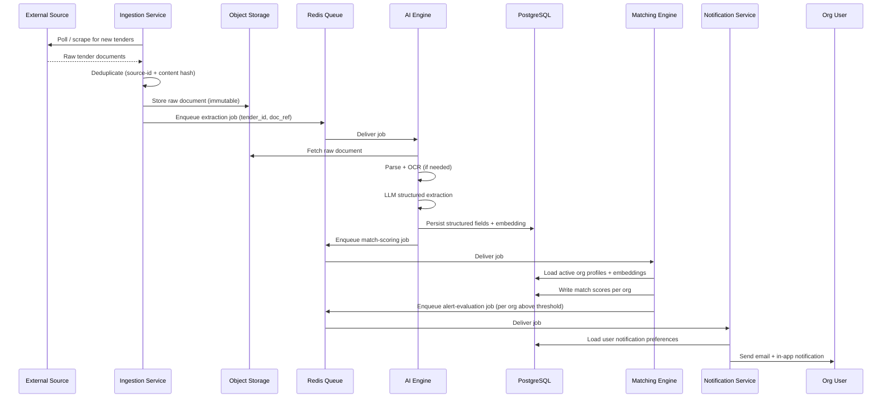

### 10.2 User Search & Semantic Match

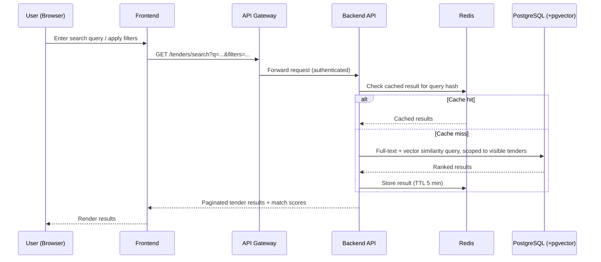

### 10.3 Eligibility Checklist & RAG Q&A

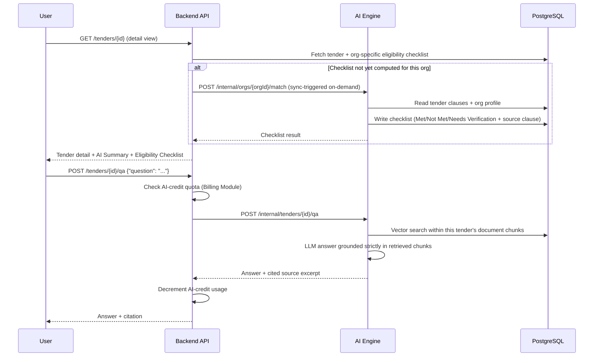

### 10.4 Authentication (Login + Token Refresh)

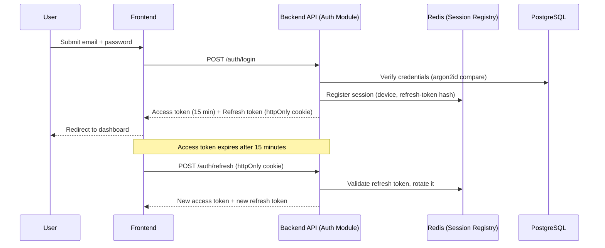

### 10.5 Bid Submission with Enterprise Approval Gate

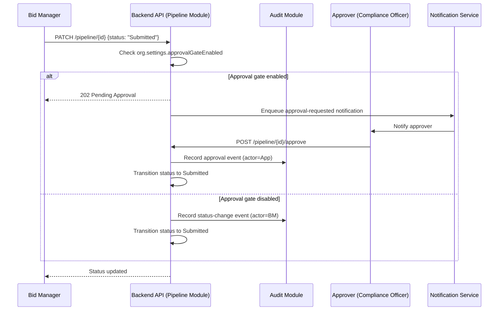

---

## 11. Data Flow Diagrams

### 11.1 Level 0 — Context DFD

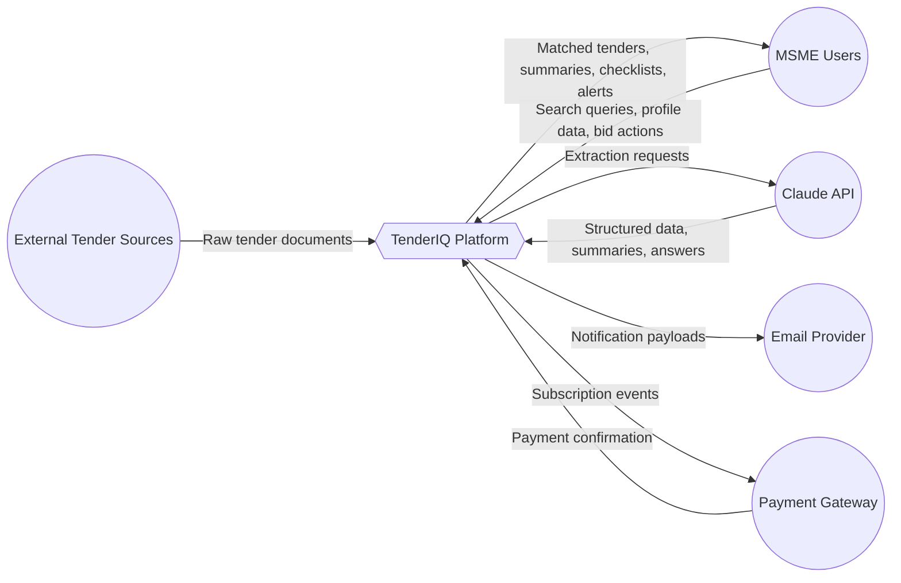

### 11.2 Level 1 — Detailed DFD

```mermaid
flowchart TB
    subgraph External
        Sources[(Tender Source Portals)]
    end

    subgraph P1[Process: Ingestion]
        direction TB
        P1a[Fetch & Deduplicate]
    end

    subgraph D1[(Data Store: Object Storage - Raw Documents)]
    end

    subgraph P2[Process: AI Extraction]
        direction TB
        P2a[Parse & OCR]
        P2b[LLM Structured Extraction]
        P2c[Generate Embeddings]
    end

    subgraph D2[(Data Store: PostgreSQL - Tenders, Embeddings)]
    end

    subgraph P3[Process: Matching & Scoring]
        direction TB
        P3a[Rule-based Eligibility Filter]
        P3b[Semantic Similarity Scoring]
        P3c[Calibration from Historical Outcomes]
    end

    subgraph D3[(Data Store: PostgreSQL - Match Scores)]
    end

    subgraph P4[Process: Alerting]
    end

    subgraph D4[(Data Store: Notification Log)]
    end

    subgraph P5[Process: User Interaction]
        direction TB
        P5a[Search & Browse]
        P5b[Pipeline Management]
        P5c[RAG Q&A]
    end

    Sources --> P1a --> D1
    D1 --> P2a --> P2b --> P2c --> D2
    D2 --> P3a --> P3b --> P3c --> D3
    D3 --> P4 --> D4
    P4 --> P5a
    D2 --> P5a
    D3 --> P5a
    P5a --> P5b
    P5b -->|Outcome data| P3c
    D2 --> P5c
    P5c -->|Grounded answer| P5a
```

---

## 12. Deployment Diagram

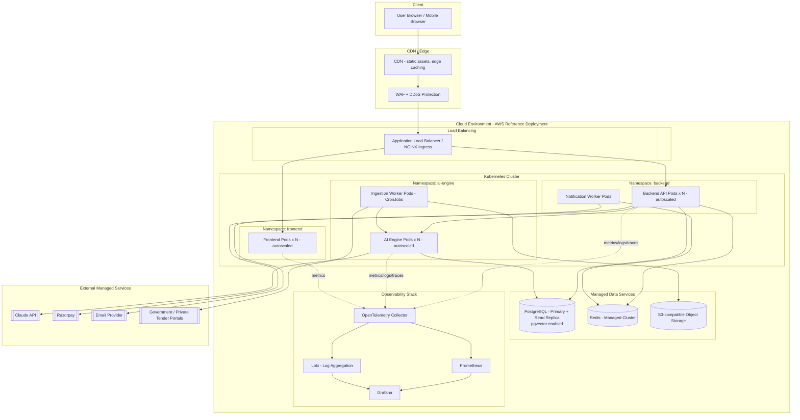

**Environments**: `local` (Docker Compose, all services + MinIO + local Postgres/Redis), `staging` (scaled-down mirror of prod topology, synthetic/anonymized data), `production` (topology above, multi-AZ for data services).

---

## 13. Security Architecture

### 13.1 Authentication & Authorization

- **AuthN**: email/password (argon2id hashing) or Google OAuth2. JWT access tokens (15 min TTL) + rotating refresh tokens (httpOnly, `Secure`, `SameSite=Strict` cookies).
- **AuthZ**: Role-Based Access Control scoped per Organization (`Owner`, `Bid Manager`, `Viewer`); every organization-scoped endpoint resolves the organization ID from the authenticated session/membership, never trusting a client-supplied org ID without a membership check.
- **Service-to-service**: Backend ↔ AI Engine calls authenticated via a rotated shared service token over an internal-only network path (not internet-routable); no public ingress to the AI Engine.

### 13.2 Data Protection

- TLS 1.2+ enforced at the edge (WAF/ALB) for all external traffic; internal service-to-service traffic within the cluster network.
- AES-256 encryption at rest for PostgreSQL, Redis persistence, and object storage.
- Sensitive fields (GST, PAN) are stored with field-level access logging; displayed masked by default in the UI, revealed only on explicit user action (audit-logged).
- Raw tender documents in object storage are immutable and access-controlled via signed, time-limited URLs — never publicly listable.

### 13.3 Tenant Isolation

- Every data access path for organization-scoped resources includes a mandatory `organization_id` predicate enforced at the data-access layer (repository pattern), not left to ad-hoc query construction — closing the IDOR class of vulnerability described in NFR-5.
- Automated tenant-isolation test suite runs in CI against every PR touching a data-access module (see ENGINEERING_GUIDE.md).

### 13.4 API Security

- Rate limiting at the gateway (per-IP) and per-organization (per-plan quota) layers.
- Input validation via schema validation (DTOs) at every Backend API boundary; rejects unknown fields.
- AI-facing endpoints (summary, Q&A, draft) are additionally gated by AI-credit quota checks to prevent cost-based abuse.
- Standard OWASP Top-10 mitigations: parameterized queries (ORM), output encoding (XSS), CSRF tokens for cookie-based flows, strict CORS allow-list, dependency vulnerability scanning in CI.

### 13.5 Secrets Management

- No secrets in source control or container images; secrets injected at runtime via the cluster's secret store (Kubernetes Secrets backed by a cloud KMS, or equivalent in local/dev via `.env` excluded from VCS).
- LLM API keys, payment gateway keys, and DB credentials are rotated on a defined schedule and immediately on suspected compromise.

### 13.6 Audit & Compliance

- Every mutating action (org changes, membership changes, pipeline status transitions, billing changes) is written to an append-only Audit Log with actor, timestamp, before/after state.
- Aligns with DPDp Act, 2023 expectations: purpose-limited use of PII, user-initiated data export/delete requests supported via an internal admin process, breach-notification runbook maintained in ENGINEERING_GUIDE.md.

---

## 14. Scalability Strategy

| Dimension | Strategy |
|---|---|
| **Compute (Frontend/Backend/AI Engine)** | All application services are stateless and horizontally autoscaled (Kubernetes HPA) on CPU/queue-depth signals. |
| **Database reads** | PostgreSQL read replica(s) for search/dashboard read traffic; writes remain on primary. |
| **Database growth** | Tender and embedding tables partitioned by ingestion date once volume warrants (documented threshold: >5M tender rows); connection pooling via PgBouncer. |
| **Caching** | Redis caches hot search results, tender detail pages, and computed match scores with short TTLs; cache invalidated on re-extraction/re-scoring. |
| **Async processing** | Ingestion and AI extraction are entirely queue-driven (Redis/BullMQ); queue depth is a first-class autoscaling signal for AI Engine and Ingestion worker pods. |
| **AI cost/throughput** | LLM calls are batched where possible (bulk extraction), response-cached per tender, and truncated/chunked for large documents to control both latency and cost. |
| **Search at scale** | Postgres FTS + pgvector is the default; documented migration path to OpenSearch/dedicated vector store is defined once tender volume or query latency crosses the NFR-2 threshold (Section 18). |
| **Static assets** | CDN-fronted for the frontend build and any public tender-summary pages. |
| **Multi-region** | Not required at MSME-launch scale; architecture does not preclude it — stateless compute + managed data services support a future multi-region read path (Section 18). |

---

## 15. Logging

- **Structure**: All services emit structured JSON logs (never unstructured `print`/`console.log` in production code paths — see ENGINEERING_GUIDE.md).
- **Correlation**: Every inbound request is assigned a `correlation_id` at the API Gateway, propagated through Backend API → AI Engine → async job payloads, enabling full request tracing across services (satisfies NFR-9).
- **Levels**: `DEBUG` (local/staging only), `INFO` (business events: tender ingested, match computed, bid submitted), `WARN` (degraded but recovered, e.g., retried extraction), `ERROR` (failed operation requiring attention), `CRITICAL` (service-impacting).
- **PII discipline**: Logs never contain raw GST/PAN or password/token values; PII fields are redacted/hashed before logging.
- **Aggregation**: All service logs ship to a centralized aggregator (Loki) via the OpenTelemetry Collector; queryable by correlation ID, organization ID (for support), and service name.
- **Retention**: Application logs retained 30 days hot, 90 days cold archive; Audit Log (Section 13.6) retained indefinitely as it is a compliance record, not an operational log.

---

## 16. Monitoring

- **Health checks**: every service exposes `/healthz` (liveness) and `/readyz` (readiness incl. DB/Redis connectivity) consumed by Kubernetes probes.
- **Metrics**: exposed via OpenTelemetry → Prometheus. Key metrics per service: request rate, error rate, latency histograms (RED method); queue depth and processing lag for async workers; LLM call latency/cost/token-usage for the AI Engine.
- **Dashboards**: Grafana dashboards per service plus a platform-level dashboard covering the NFR-2 latency targets, ingestion source health (US-10), and AI extraction confidence trend (US-11).
- **Tracing**: OpenTelemetry distributed tracing across Backend API → AI Engine → data stores, keyed by `correlation_id`, for root-causing latency and errors across service boundaries.
- **SLOs**: 
  - API availability ≥ 99.5% monthly (NFR-1) → alert if 5-minute error rate > 2%.
  - Search p95 latency ≤ 500ms → alert on sustained breach over 10 minutes.
  - Ingestion pipeline: alert if any configured source has zero successful runs in 24h.
- **Alerting**: Alerts route to the on-call channel with severity-based paging; every alert links to the relevant Grafana dashboard and runbook entry in ENGINEERING_GUIDE.md.

---

## 17. Risks

| ID | Risk | Category | Likelihood | Impact | Mitigation |
|---|---|---|---|---|---|
| R-1 | Source portals change markup/structure, breaking scrapers | Technical | High | Medium | Adapter-per-source design (9.2) isolates breakage; ingestion-health dashboard (US-10) surfaces failures fast; automated structural-change detection with alerting. |
| R-2 | AI extraction produces incorrect eligibility/deadline data, causing a user to miss a real deadline or misjudge eligibility | AI / Product | Medium | High | Every AI-derived field is traceable to source clause (NFR-6); low-confidence extractions flagged for review; deadline reminders always computed from the extracted date with a visible "verify against source PDF" link. |
| R-3 | Legal/ToS risk from scraping certain source portals | Legal | Medium | High | Prioritize official APIs/open-data feeds where available (e.g., GeM open data); maintain a source allow-list reviewed by legal; respect robots.txt and rate limits; fallback to manual/partner data-sharing agreements for restricted sources. |
| R-4 | LLM provider cost scales faster than subscription revenue | Business / Cost | Medium | Medium | AI-credit metering and plan gating (FR-SUB-3); response caching; batched extraction; scoped RAG context to minimize token usage. |
| R-5 | Tenant data isolation bug exposes one organization's data to another | Security | Low | Critical | Enforced data-access-layer tenant predicate (13.3); automated tenant-isolation CI test suite; code review checklist requirement in ENGINEERING_GUIDE.md. |
| R-6 | Over-reliance on AI match score causes users to miss good-fit tenders scored low (false negative) | AI / Product | Medium | Medium | Match score is advisory, not a hard filter — full search/browse always available unfiltered; score reasoning is shown, not a black box; continuous calibration from win/loss outcomes (FR-BID-3). |
| R-7 | Single-region deployment creates availability exposure to a regional cloud outage | Infrastructure | Low | High | Multi-AZ within region for data services at launch; architecture documented as multi-region-ready (Section 14) for future scope if justified by growth. |
| R-8 | Low digital literacy among target users (Persona: Priya) leads to low activation/adoption despite correct functionality | Product / Adoption | Medium | High | UX simplicity prioritized over feature density in frontend design; WhatsApp-based alerting planned (Section 18) to meet users on a familiar channel. |
| R-9 | Payment gateway or subscription billing failure blocks paying customers from renewing/accessing the platform | Business | Low | Medium | Grace period before feature lockout on payment failure; automated retry + user notification via webhook handling; manual override path for Ops Admin. |

---

## 18. Future Scope

- **WhatsApp-based alerts and conversational Q&A**, meeting low-digital-literacy users (Persona: Priya) on their primary channel.
- **Mobile application** (React Native) sharing the same Backend API contract.
- **Dedicated search infrastructure** (OpenSearch or equivalent) once tender volume/query latency crosses the threshold documented in Section 14, decoupling full-text search from the primary transactional database.
- **Dedicated vector store** (e.g., Qdrant) if embedding volume/query patterns outgrow `pgvector`'s efficient operating range.
- **Multi-language support** (Hindi and regional languages) for both UI and AI summarization/extraction — data model already stores language-tagged fields to support this without schema rework (NFR-12).
- **Marketplace for procurement consultants**, allowing MSMEs to engage a vetted consultant (Persona: Anita) directly through the platform.
- **Automated bid-document generation** beyond boilerplate sections, expanding FR-BID-2 toward fuller technical/financial proposal drafting, always retaining mandatory human review.
- **Direct integration with government e-procurement submission APIs** (where available) to reduce manual re-entry, strictly as an assist — never a fully automated submission path, to preserve human accountability for bid content.
- **Blockchain-anchored audit trail** for enterprise/compliance-sensitive customers requiring tamper-evident bid history (extends Section 13.6).
- **Peer benchmarking analytics** — anonymized, aggregated win-rate benchmarks by sector/category to help MSMEs gauge competitiveness (subject to privacy-preserving aggregation design).
- **Multi-region deployment** if user base growth or data-residency requirements justify it (architecture already compute-portable per NFR-10, Section 14).
