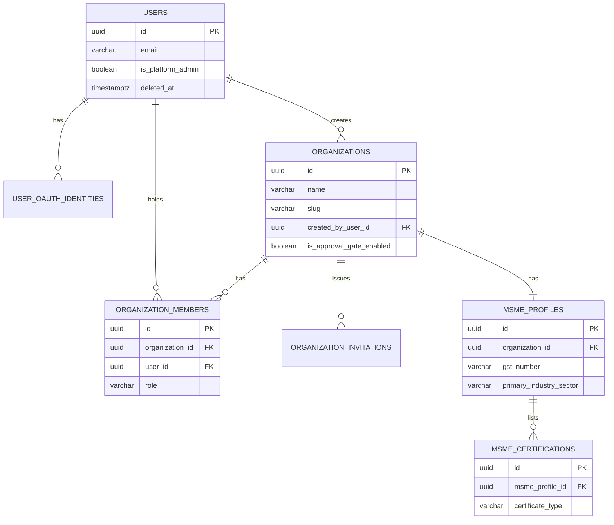
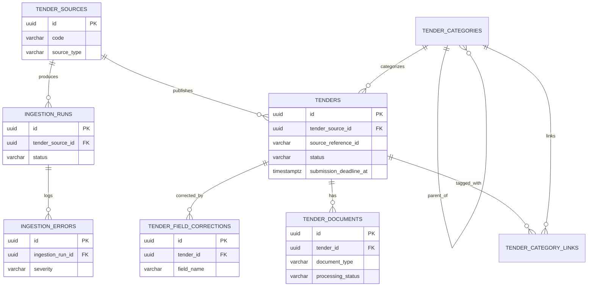
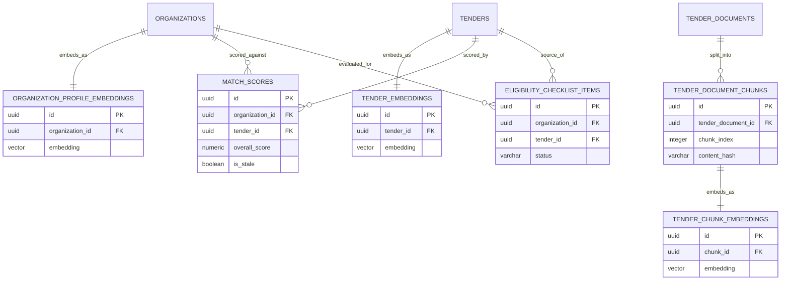
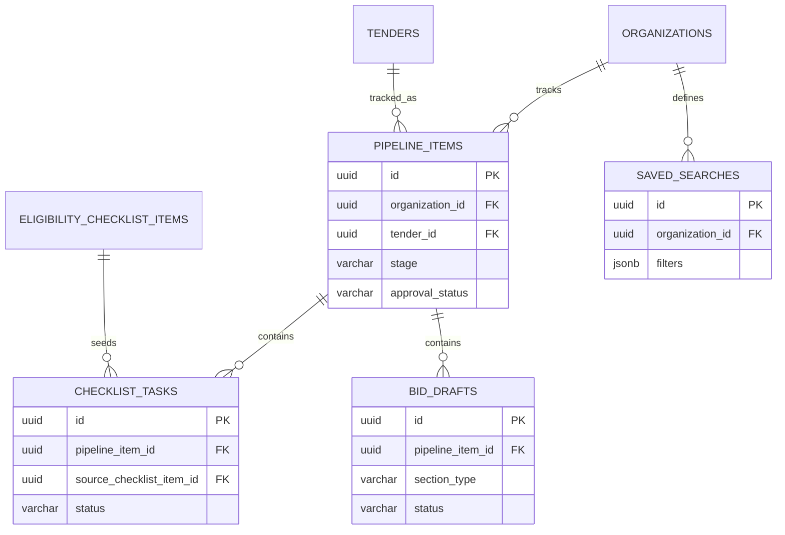
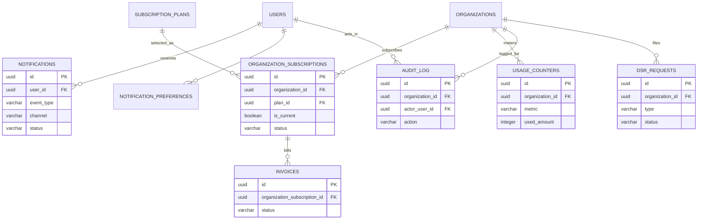

# TenderIQ — Database Design

## Document Control

| Field | Value |
|---|---|
| Document | DATABASE.md |
| Product | TenderIQ — AI Procurement Intelligence Platform for MSMEs |
| Version | 1.1 (Baseline + Addendum) |
| Status | Approved — Authoritative Source of Truth for schema design |
| Owner | Chief Software Architect |
| Last Updated | 2026-07-30 |
| Primary Store | PostgreSQL 15+ with `pgvector` extension (per [Architecture.md](../architecture/Architecture.md) §8.1) |
| Change Policy | This is the single database design for TenderIQ. Every service reads/writes through the ownership boundaries defined here (Architecture.md §8.3). No table is to be added, renamed, or restructured outside this document without updating it first. |
| Changelog | v1.1 — added `tender_document_chunks` and `tender_chunk_embeddings` (§7.7) as an additive, non-breaking addendum, registering the chunk-level RAG storage that [AI_DESIGN.md](../ai/AI_DESIGN.md) §3/§4/§7 depends on. No existing table was altered. |
| Related Documents | [Architecture.md](../architecture/Architecture.md) · [API_SPEC.md](../api/API_SPEC.md) · [AI_DESIGN.md](../ai/AI_DESIGN.md) · [ENGINEERING_GUIDE.md](../engineering/ENGINEERING_GUIDE.md) |

> This document describes structure only — no SQL/DDL. Column "Type" values name the intended PostgreSQL type so the design is implementable, but table definitions below are specification, not executable code.

---

## 1. Scope & Domain Grouping

The schema is organized into six domains, each owned by the service named in Architecture.md §8.3:

| Domain | Tables | Owning Service |
|---|---|---|
| Identity & Organization | `users`, `user_oauth_identities`, `organizations`, `organization_members`, `organization_invitations`, `msme_profiles`, `msme_certifications` | Backend API |
| Tender Taxonomy & Ingestion | `tender_sources`, `tender_categories`, `tenders`, `tender_category_links`, `tender_documents`, `tender_field_corrections`, `ingestion_runs`, `ingestion_errors` | Ingestion Service (writes) / AI Engine (extraction writes) |
| AI & Matching | `tender_embeddings`, `organization_profile_embeddings`, `match_scores`, `eligibility_checklist_items`, `tender_document_chunks`, `tender_chunk_embeddings` | AI Engine |
| Bid Workspace | `pipeline_items`, `checklist_tasks`, `bid_drafts`, `saved_searches` | Backend API |
| Notifications | `notifications`, `notification_preferences` | Notification Service |
| Billing & Compliance | `subscription_plans`, `organization_subscriptions`, `invoices`, `usage_counters`, `audit_log`, `dsr_requests` | Backend API |

Per Architecture.md §9.4: the AI Engine is the **only** writer of extracted tender fields, embeddings, match scores, and eligibility checklist content. The Backend API is read-only on those tables and writes only user-generated overlay data (pipeline state, checklist tasks, notes, bookmarks-as-pipeline-entries).

---

## 2. Naming Conventions

| Element | Convention | Example |
|---|---|---|
| Table names | `snake_case`, plural noun | `organizations`, `pipeline_items` |
| Column names | `snake_case`, singular | `title`, `submission_deadline_at` |
| Primary key | Always `id` | `id` |
| Foreign key | `<referenced_table_singular>_id` | `organization_id`, `tender_id`, `assignee_user_id` (role-qualified when a table has more than one FK to the same referenced table) |
| Join / link tables | Named for the relationship, not a mechanical concatenation | `tender_category_links`, `organization_members` |
| Boolean columns | Prefixed `is_` or `has_` | `is_active`, `is_email_verified` |
| Timestamp columns | Suffixed `_at` (instant); date-only columns suffixed `_date` | `created_at`, `expires_at`, `period_start_date` |
| Monetary columns | Suffixed `_amount`, paired with a `_currency` column (ISO 4217, default `INR`) | `tender_value_amount` / `tender_value_currency` |
| Enumerated/status columns | Suffixed `_status`, `_role`, `_stage`, or `_type`; allowed values documented in the table's Constraints row | `status`, `role`, `stage` |
| JSON columns | Descriptive name indicating content, typed `jsonb` | `filters`, `score_breakdown`, `connector_config` |
| Array columns | Plural noun, typed as a native Postgres array | `nic_codes text[]`, `preferred_locations text[]` |
| Vector columns | Always named `embedding`, typed `vector(n)` | `embedding vector(1536)` |
| Audit columns present on every table | `created_at`, `updated_at`; most tables additionally carry `created_by_user_id` | — |

---

## 3. Data Type Reference

| Conceptual Type | PostgreSQL Type | Notes |
|---|---|---|
| Identifier | `uuid` | See UUID Policy, §4. |
| Short text | `varchar(255)` | Names, titles, emails. |
| Long text | `text` | Descriptions, summaries, freeform notes. |
| Money | `numeric(14,2)` | Never `float`/`double` for monetary values. |
| Currency code | `char(3)` | ISO 4217, default `'INR'`. |
| Whole number | `integer` | Counts, limits. |
| Fractional score | `numeric(5,2)` | Match scores (0–100), confidence (0–1 uses `numeric(3,2)`). |
| Boolean | `boolean` | |
| Instant in time | `timestamptz` | Always timezone-aware; UTC at rest. |
| Date only | `date` | Certification expiry, billing period boundaries. |
| Structured/variable data | `jsonb` | Indexed with GIN where queried. |
| Text array | `text[]` | Used only for small, order-insensitive value lists (e.g., NIC codes) to avoid over-normalizing low-cardinality data. |
| Full-text search vector | `tsvector` | Generated/maintained column on `tenders.search_vector`. |
| Vector embedding | `vector(n)` | Provided by `pgvector`; dimension `n` fixed by the embedding model documented in AI_DESIGN.md (1536 assumed as the current default). |
| Network address | `inet` | `audit_log.ip_address`. |

---

## 4. UUID Policy

- **Every primary key is a UUID**, generated as **UUIDv7** (time-ordered) at the application layer before insert — never a database-default `gen_random_uuid()` v4 and never an auto-incrementing integer.
- **Rationale**:
  - Time-ordering keeps B-tree PK index insertion sequential (avoiding the random-insert index bloat of UUIDv4) while remaining non-sequential/non-guessable, which matters for tenant-isolation defense-in-depth (Architecture.md §13.3) — an integer PK would let a caller enumerate other organizations' resource IDs.
  - Application-generated (not DB-generated) IDs let a service reference a related row's ID before the insert transaction commits (needed across service boundaries, e.g., Ingestion Service writing a `tenders.id` that the AI Engine references in the same logical unit of work).
- **External/natural identifiers are never used as primary keys.** A source system's own tender ID is stored as `tenders.source_reference_id` (a plain `text` column, unique only in combination with `tender_source_id`), not as `tenders.id`.
- Foreign keys always reference the parent's UUID `id` column — no composite or natural-key foreign keys anywhere in the schema.

---

## 5. Soft Delete Policy

Every table falls into exactly one of three deletion categories:

| Category | Behavior | Applies To |
|---|---|---|
| **A — User-Owned, Soft-Deletable** | Carries a nullable `deleted_at timestamptz`. A non-null value means the row is logically deleted. Every repository-layer query filters `deleted_at IS NULL` by default (Architecture.md §9.4); nothing above the data-access layer is trusted to remember this filter. Uniqueness constraints that must only apply to "live" rows are implemented as **partial unique indexes** with a `WHERE deleted_at IS NULL` predicate. | `users`, `organizations`, `organization_members`, `msme_profiles`, `msme_certifications`, `pipeline_items`, `checklist_tasks`, `bid_drafts`, `saved_searches` |
| **B — System-of-Record, Never User-Deleted** | No `deleted_at` column. Lifecycle is expressed through a `status` column, not deletion. Rows are written by system pipelines (ingestion/AI extraction) and are never deleted by user action; a user can only affect these indirectly (e.g., a tender's `status` moves to `cancelled` because the *source* cancelled it, not because a TenderIQ user deleted it). | `tenders`, `tender_documents`, `tender_field_corrections`, `tender_embeddings`, `organization_profile_embeddings`, `match_scores`, `eligibility_checklist_items`, `ingestion_runs`, `ingestion_errors`, `tender_sources`, `tender_categories`, `tender_category_links`, `subscription_plans`, `organization_subscriptions`, `invoices` |
| **C — Append-Only Ledger / Retention-Purged** | Rows are never updated or deleted by application code. `audit_log` and `dsr_requests` are permanent compliance records with no deletion path at all. `notifications`, `ingestion_errors`, and `usage_counters` are append-only in normal operation but are subject to a scheduled hard-purge job once past their retention window (Architecture.md §15) — this is an operational job, not a user-facing delete. | `audit_log`, `dsr_requests`, `notifications`, `usage_counters` |

Notes:
- `user_oauth_identities` and `organization_invitations` have no `deleted_at`: an OAuth identity is hard-removed if unlinked (no history value in keeping it), and an invitation's lifecycle is expressed via its own `status` enum (`pending` / `accepted` / `expired` / `revoked`) rather than deletion.
- Soft-deleting a parent in Category A does **not** cascade a soft-delete to children automatically at the database level (no triggers); each service enforces cascade-or-block rules at the application layer per the FK `ON DELETE` behavior documented per table in §8.

---

## 6. Audit Strategy

Two complementary layers, per Architecture.md §13.6:

1. **Row-level audit columns** on every table: `created_at` (set once, immutable), `updated_at` (bumped on every write), and — on tables where "who" matters — `created_by_user_id` (nullable, since system processes such as ingestion/AI extraction create rows with no human actor).
2. **`audit_log` — the append-only compliance ledger.** Every mutating action enumerated in Architecture.md §13.6 (organization changes, membership changes, pipeline stage transitions including approvals, billing/subscription changes, MSME profile edits, DSR request handling) writes exactly one row here, capturing:
   - `actor_user_id` (nullable — `null` means a system/automated actor),
   - `organization_id` (nullable — some actions are platform-level),
   - `action` (a dotted event name, e.g. `pipeline_item.status_change`, `organization_member.role_change`, `msme_profile.update`),
   - `entity_type` / `entity_id` (what was changed),
   - `before_state` / `after_state` (`jsonb` snapshots of the affected fields only, not full-row dumps, to keep PII exposure in the ledger minimal),
   - `ip_address`, `user_agent`, `correlation_id` (ties the audit row back to the originating request trace, per Architecture.md §15).
   - `audit_log` rows are **never updated or deleted** by application code; in production the application's database role is granted `INSERT`/`SELECT` only on this table, not `UPDATE`/`DELETE`, as a defense-in-depth control.
3. Tables holding AI-derived facts (`tenders`' extracted fields, `eligibility_checklist_items`) additionally use **`tender_field_corrections`** as a field-level correction ledger (see §8.2) so a human correction never silently overwrites the AI's original extraction — both values are retained (Architecture.md NFR-6).

---

## 7. Entity Definitions

### 7.1 Identity & Organization Domain

#### `users`

| Column | Type | Constraints | Description |
|---|---|---|---|
| `id` | uuid | PK | |
| `email` | varchar(255) | NOT NULL, UNIQUE | Login identifier. |
| `password_hash` | text | NULL | argon2id hash; `null` for OAuth-only accounts. |
| `full_name` | varchar(255) | NOT NULL | |
| `phone_number` | varchar(20) | NULL | |
| `is_email_verified` | boolean | NOT NULL, DEFAULT false | |
| `is_platform_admin` | boolean | NOT NULL, DEFAULT false | Grants access to internal Ops Admin tooling (Persona 4). |
| `last_login_at` | timestamptz | NULL | |
| `deleted_at` | timestamptz | NULL | Category A. |
| `created_at` | timestamptz | NOT NULL, DEFAULT now | |
| `updated_at` | timestamptz | NOT NULL | |

**Indexes**: unique index on `email` (partial, `WHERE deleted_at IS NULL`); index on `is_platform_admin` (small, used by internal tooling only).

#### `user_oauth_identities`

| Column | Type | Constraints | Description |
|---|---|---|---|
| `id` | uuid | PK | |
| `user_id` | uuid | FK → `users.id`, NOT NULL, ON DELETE CASCADE | |
| `provider` | varchar(50) | NOT NULL | e.g. `google`. |
| `provider_account_id` | varchar(255) | NOT NULL | |
| `created_at` | timestamptz | NOT NULL, DEFAULT now | |

**Constraints**: UNIQUE (`provider`, `provider_account_id`). **Indexes**: index on `user_id`.

#### `organizations`

| Column | Type | Constraints | Description |
|---|---|---|---|
| `id` | uuid | PK | |
| `name` | varchar(255) | NOT NULL | |
| `slug` | varchar(255) | NOT NULL, UNIQUE | URL-safe identifier. |
| `created_by_user_id` | uuid | FK → `users.id`, NOT NULL, ON DELETE RESTRICT | |
| `is_approval_gate_enabled` | boolean | NOT NULL, DEFAULT false | Enterprise-tier bid approval workflow (Architecture.md §9.1, US-12). |
| `deleted_at` | timestamptz | NULL | Category A. |
| `created_at` | timestamptz | NOT NULL, DEFAULT now | |
| `updated_at` | timestamptz | NOT NULL | |

**Indexes**: unique partial index on `slug` (`WHERE deleted_at IS NULL`).

#### `organization_members`

Join table between `users` and `organizations`, carrying role.

| Column | Type | Constraints | Description |
|---|---|---|---|
| `id` | uuid | PK | |
| `organization_id` | uuid | FK → `organizations.id`, NOT NULL, ON DELETE CASCADE | |
| `user_id` | uuid | FK → `users.id`, NOT NULL, ON DELETE CASCADE | |
| `role` | varchar(20) | NOT NULL, CHECK IN (`owner`, `bid_manager`, `viewer`) | |
| `invited_by_user_id` | uuid | FK → `users.id`, NULL, ON DELETE SET NULL | |
| `joined_at` | timestamptz | NOT NULL, DEFAULT now | |
| `deleted_at` | timestamptz | NULL | Category A — member removal. |
| `created_at` | timestamptz | NOT NULL, DEFAULT now | |
| `updated_at` | timestamptz | NOT NULL | |

**Constraints**: partial UNIQUE (`organization_id`, `user_id`) `WHERE deleted_at IS NULL` — a user cannot hold two simultaneous active memberships in the same org. **Indexes**: index on `organization_id`; index on `user_id` (supports Persona 3 "Anita" org-switcher, US-8).

#### `organization_invitations`

| Column | Type | Constraints | Description |
|---|---|---|---|
| `id` | uuid | PK | |
| `organization_id` | uuid | FK → `organizations.id`, NOT NULL, ON DELETE CASCADE | |
| `invited_email` | varchar(255) | NOT NULL | |
| `role` | varchar(20) | NOT NULL, CHECK IN (`owner`, `bid_manager`, `viewer`) | |
| `invited_by_user_id` | uuid | FK → `users.id`, NOT NULL, ON DELETE RESTRICT | |
| `token_hash` | text | NOT NULL, UNIQUE | Hash of the invitation token sent by email; raw token never stored. |
| `status` | varchar(20) | NOT NULL, DEFAULT `pending`, CHECK IN (`pending`, `accepted`, `expired`, `revoked`) | |
| `expires_at` | timestamptz | NOT NULL | |
| `accepted_at` | timestamptz | NULL | |
| `created_at` | timestamptz | NOT NULL, DEFAULT now | |

**Indexes**: index on (`organization_id`, `status`); index on `invited_email`.

#### `msme_profiles`

1:1 with `organizations`.

| Column | Type | Constraints | Description |
|---|---|---|---|
| `id` | uuid | PK | |
| `organization_id` | uuid | FK → `organizations.id`, NOT NULL, UNIQUE, ON DELETE CASCADE | |
| `gst_number` | varchar(15) | NULL, UNIQUE | Masked in UI by default (Architecture.md §13.2). |
| `pan_number` | varchar(10) | NULL | Masked in UI by default. |
| `udyam_registration_number` | varchar(30) | NULL | |
| `primary_industry_sector` | varchar(100) | NOT NULL | |
| `nic_codes` | text[] | NULL | Small, order-insensitive list — kept denormalized (see §3). |
| `annual_turnover_year1_amount` | numeric(14,2) | NULL | Most recent financial year. |
| `annual_turnover_year2_amount` | numeric(14,2) | NULL | |
| `annual_turnover_year3_amount` | numeric(14,2) | NULL | |
| `turnover_currency` | char(3) | NOT NULL, DEFAULT `INR` | |
| `years_in_operation` | integer | NULL | |
| `preferred_locations` | text[] | NULL | States/districts of interest. |
| `deleted_at` | timestamptz | NULL | Category A. |
| `created_at` | timestamptz | NOT NULL, DEFAULT now | |
| `updated_at` | timestamptz | NOT NULL | |

**Indexes**: unique partial index on `organization_id` (`WHERE deleted_at IS NULL`); unique partial index on `gst_number` (`WHERE gst_number IS NOT NULL AND deleted_at IS NULL`).

#### `msme_certifications`

| Column | Type | Constraints | Description |
|---|---|---|---|
| `id` | uuid | PK | |
| `msme_profile_id` | uuid | FK → `msme_profiles.id`, NOT NULL, ON DELETE CASCADE | |
| `certificate_type` | varchar(30) | NOT NULL, CHECK IN (`udyam`, `iso`, `mse`, `startup_recognition`, `other`) | |
| `certificate_number` | varchar(100) | NOT NULL | |
| `issuing_body` | varchar(255) | NULL | |
| `issued_at` | date | NULL | |
| `expires_at` | date | NULL | |
| `object_storage_key` | text | NULL | Reference to uploaded certificate document. |
| `deleted_at` | timestamptz | NULL | Category A. |
| `created_at` | timestamptz | NOT NULL, DEFAULT now | |
| `updated_at` | timestamptz | NOT NULL | |

**Indexes**: index on (`msme_profile_id`, `certificate_type`).

---

### 7.2 Tender Taxonomy & Ingestion Domain

#### `tender_sources`

| Column | Type | Constraints | Description |
|---|---|---|---|
| `id` | uuid | PK | |
| `code` | varchar(50) | NOT NULL, UNIQUE | e.g. `gem`, `cppp`, `state_mh`, `aggregator_x`. |
| `name` | varchar(255) | NOT NULL | |
| `source_type` | varchar(30) | NOT NULL, CHECK IN (`government`, `psu`, `state`, `private_aggregator`) | |
| `base_url` | text | NOT NULL | |
| `connector_config` | jsonb | NULL | Source-specific connector settings (Architecture.md §9.2 `SourceConnector` adapter). |
| `is_active` | boolean | NOT NULL, DEFAULT true | |
| `created_at` | timestamptz | NOT NULL, DEFAULT now | |
| `updated_at` | timestamptz | NOT NULL | |

Category B — no soft delete; a retired source is marked `is_active = false`.

#### `tender_categories`

Self-referential taxonomy tree.

| Column | Type | Constraints | Description |
|---|---|---|---|
| `id` | uuid | PK | |
| `name` | varchar(255) | NOT NULL, UNIQUE | |
| `parent_category_id` | uuid | FK → `tender_categories.id`, NULL, ON DELETE SET NULL | |
| `nic_code` | varchar(20) | NULL | |
| `created_at` | timestamptz | NOT NULL, DEFAULT now | |
| `updated_at` | timestamptz | NOT NULL | |

**Indexes**: index on `parent_category_id`.

#### `tenders`

The canonical tender record. Written only by the Ingestion Service (initial insert) and the AI Engine (extraction updates) — see Architecture.md §9.4.

| Column | Type | Constraints | Description |
|---|---|---|---|
| `id` | uuid | PK | |
| `tender_source_id` | uuid | FK → `tender_sources.id`, NOT NULL, ON DELETE RESTRICT | |
| `source_reference_id` | varchar(255) | NOT NULL | The source portal's own tender ID/number. |
| `title` | text | NOT NULL | |
| `issuing_authority` | varchar(255) | NULL | |
| `description` | text | NULL | Raw scope-of-work text as extracted. |
| `ai_summary` | text | NULL | Generated summary (FR-AI-4); `null` until first extraction completes. |
| `tender_value_amount` | numeric(14,2) | NULL | |
| `tender_value_currency` | char(3) | NOT NULL, DEFAULT `INR` | |
| `emd_amount` | numeric(14,2) | NULL | |
| `emd_currency` | char(3) | NOT NULL, DEFAULT `INR` | |
| `primary_category_id` | uuid | FK → `tender_categories.id`, NULL, ON DELETE SET NULL | |
| `location_state` | varchar(100) | NULL | |
| `location_city` | varchar(100) | NULL | |
| `published_at` | timestamptz | NULL | |
| `submission_deadline_at` | timestamptz | NULL | |
| `opening_at` | timestamptz | NULL | |
| `status` | varchar(30) | NOT NULL, DEFAULT `pending_extraction`, CHECK IN (`pending_extraction`, `active`, `closed`, `cancelled`, `awarded`) | |
| `extraction_confidence_overall` | numeric(3,2) | NULL | 0.00–1.00; drives US-11 (extraction confidence trend). |
| `content_hash` | varchar(64) | NOT NULL | SHA-256 of normalized content; supports cross-source dedup (FR-ING-2). |
| `search_vector` | tsvector | NULL | Maintained from `title` + `description` + `issuing_authority` for full-text search (FR-DIS-1). |
| `created_at` | timestamptz | NOT NULL, DEFAULT now | |
| `updated_at` | timestamptz | NOT NULL | |

**Constraints**: UNIQUE (`tender_source_id`, `source_reference_id`). Category B — no `deleted_at`.

**Indexes**:
- GIN index on `search_vector` (full-text search, FR-DIS-1).
- Index on `submission_deadline_at` (deadline-window queries, US-4).
- Index on (`status`, `submission_deadline_at`) (default "active, upcoming deadline" listing).
- Index on `primary_category_id`.
- Index on `content_hash` (dedup lookups).

#### `tender_category_links`

Many-to-many between `tenders` and `tender_categories` (a tender may span secondary categories beyond its primary).

| Column | Type | Constraints | Description |
|---|---|---|---|
| `id` | uuid | PK | |
| `tender_id` | uuid | FK → `tenders.id`, NOT NULL, ON DELETE CASCADE | |
| `category_id` | uuid | FK → `tender_categories.id`, NOT NULL, ON DELETE CASCADE | |
| `is_primary` | boolean | NOT NULL, DEFAULT false | |

**Constraints**: UNIQUE (`tender_id`, `category_id`).

#### `tender_documents`

Raw and processed documents linked to a tender. Immutable once `processing_status` reaches a terminal state; never mutated or deleted by end users.

| Column | Type | Constraints | Description |
|---|---|---|---|
| `id` | uuid | PK | |
| `tender_id` | uuid | FK → `tenders.id`, NOT NULL, ON DELETE CASCADE | |
| `document_type` | varchar(30) | NOT NULL, CHECK IN (`raw_source`, `extracted_text`, `supporting_annex`) | |
| `object_storage_key` | text | NOT NULL | Pointer into S3-compatible storage (Architecture.md §8.1); access only via signed URLs. |
| `file_name` | varchar(255) | NOT NULL | |
| `mime_type` | varchar(100) | NOT NULL | |
| `file_size_bytes` | bigint | NOT NULL | |
| `page_count` | integer | NULL | |
| `checksum_sha256` | varchar(64) | NOT NULL | |
| `processing_status` | varchar(30) | NOT NULL, DEFAULT `pending`, CHECK IN (`pending`, `parsed`, `ocr_required`, `failed`) | |
| `created_at` | timestamptz | NOT NULL, DEFAULT now | |
| `updated_at` | timestamptz | NOT NULL | |

**Indexes**: index on `tender_id`.

#### `tender_field_corrections`

Append-only correction ledger (NFR-6) — a human or system correction to an AI-extracted field never overwrites history.

| Column | Type | Constraints | Description |
|---|---|---|---|
| `id` | uuid | PK | |
| `tender_id` | uuid | FK → `tenders.id`, NOT NULL, ON DELETE CASCADE | |
| `field_name` | varchar(100) | NOT NULL | e.g. `submission_deadline_at`, `emd_amount`. |
| `previous_value` | jsonb | NOT NULL | |
| `corrected_value` | jsonb | NOT NULL | |
| `corrected_by_user_id` | uuid | FK → `users.id`, NULL, ON DELETE SET NULL | `null` = system/AI re-extraction correction. |
| `source_document_id` | uuid | FK → `tender_documents.id`, NULL, ON DELETE SET NULL | |
| `reason` | text | NULL | |
| `created_at` | timestamptz | NOT NULL, DEFAULT now | |

**Indexes**: index on (`tender_id`, `field_name`, `created_at`).

#### `ingestion_runs`

| Column | Type | Constraints | Description |
|---|---|---|---|
| `id` | uuid | PK | |
| `tender_source_id` | uuid | FK → `tender_sources.id`, NOT NULL, ON DELETE RESTRICT | |
| `started_at` | timestamptz | NOT NULL, DEFAULT now | |
| `completed_at` | timestamptz | NULL | |
| `status` | varchar(30) | NOT NULL, DEFAULT `running`, CHECK IN (`running`, `success`, `partial_failure`, `failed`) | |
| `tenders_fetched` | integer | NOT NULL, DEFAULT 0 | |
| `tenders_created` | integer | NOT NULL, DEFAULT 0 | |
| `tenders_updated` | integer | NOT NULL, DEFAULT 0 | |
| `tenders_deduplicated` | integer | NOT NULL, DEFAULT 0 | |

**Indexes**: index on (`tender_source_id`, `started_at`) — powers the US-10 ingestion-health dashboard.

#### `ingestion_errors`

| Column | Type | Constraints | Description |
|---|---|---|---|
| `id` | uuid | PK | |
| `ingestion_run_id` | uuid | FK → `ingestion_runs.id`, NOT NULL, ON DELETE CASCADE | |
| `tender_source_id` | uuid | FK → `tender_sources.id`, NOT NULL, ON DELETE RESTRICT | |
| `severity` | varchar(10) | NOT NULL, CHECK IN (`warning`, `error`) | |
| `message` | text | NOT NULL | |
| `source_reference_id` | varchar(255) | NULL | |
| `occurred_at` | timestamptz | NOT NULL, DEFAULT now | |

**Indexes**: index on (`tender_source_id`, `occurred_at`). Retention-purged per §5 Category C.

---

### 7.3 AI & Matching Domain

#### `tender_embeddings`

Kept as its own table (not a column on `tenders`) so the wide vector column and its `pgvector` index can be tuned independently of the hot transactional `tenders` table.

| Column | Type | Constraints | Description |
|---|---|---|---|
| `id` | uuid | PK | |
| `tender_id` | uuid | FK → `tenders.id`, NOT NULL, UNIQUE, ON DELETE CASCADE | |
| `embedding` | vector(1536) | NOT NULL | Dimension per the model documented in AI_DESIGN.md. |
| `model_name` | varchar(100) | NOT NULL | |
| `model_version` | varchar(50) | NOT NULL | |
| `generated_at` | timestamptz | NOT NULL, DEFAULT now | |

**Indexes**: `hnsw` (or `ivfflat`, per AI_DESIGN.md tuning) index on `embedding` for approximate nearest-neighbor search.

#### `organization_profile_embeddings`

| Column | Type | Constraints | Description |
|---|---|---|---|
| `id` | uuid | PK | |
| `organization_id` | uuid | FK → `organizations.id`, NOT NULL, UNIQUE, ON DELETE CASCADE | |
| `embedding` | vector(1536) | NOT NULL | |
| `model_name` | varchar(100) | NOT NULL | |
| `model_version` | varchar(50) | NOT NULL | |
| `generated_at` | timestamptz | NOT NULL, DEFAULT now | |

**Indexes**: `hnsw`/`ivfflat` index on `embedding`.

#### `match_scores`

| Column | Type | Constraints | Description |
|---|---|---|---|
| `id` | uuid | PK | |
| `organization_id` | uuid | FK → `organizations.id`, NOT NULL, ON DELETE CASCADE | |
| `tender_id` | uuid | FK → `tenders.id`, NOT NULL, ON DELETE CASCADE | |
| `overall_score` | numeric(5,2) | NOT NULL, CHECK (0–100) | FR-AI-2. |
| `rule_based_score` | numeric(5,2) | NOT NULL | Hard-eligibility component (Architecture.md §9.2). |
| `semantic_similarity_score` | numeric(5,2) | NOT NULL | Embedding cosine-similarity component. |
| `calibration_weight` | numeric(5,4) | NOT NULL, DEFAULT 1.0 | Adjusted from historical win/loss outcomes (FR-BID-3). |
| `score_breakdown` | jsonb | NULL | Human-readable reasons shown to the user (avoids a "black box" score, Risk R-6). |
| `is_stale` | boolean | NOT NULL, DEFAULT false | Set true when the tender or org profile changes, pending recompute. |
| `computed_at` | timestamptz | NOT NULL, DEFAULT now | |

**Constraints**: UNIQUE (`organization_id`, `tender_id`). **Indexes**: index on (`organization_id`, `overall_score` DESC) — powers "Recommended for you" (FR-DIS-2); index on (`tender_id`); partial index on `is_stale WHERE is_stale = true` (recompute queue scanning).

#### `eligibility_checklist_items`

| Column | Type | Constraints | Description |
|---|---|---|---|
| `id` | uuid | PK | |
| `organization_id` | uuid | FK → `organizations.id`, NOT NULL, ON DELETE CASCADE | |
| `tender_id` | uuid | FK → `tenders.id`, NOT NULL, ON DELETE CASCADE | |
| `criterion_index` | integer | NOT NULL | Ordering position within the tender's checklist. |
| `criterion_text` | text | NOT NULL | Plain-language statement of the requirement. |
| `status` | varchar(20) | NOT NULL, CHECK IN (`met`, `not_met`, `needs_verification`) | FR-AI-3. |
| `source_document_id` | uuid | FK → `tender_documents.id`, NULL, ON DELETE SET NULL | |
| `source_page_number` | integer | NULL | |
| `source_clause_excerpt` | text | NULL | Exact quoted clause (NFR-6 traceability). |
| `evaluated_at` | timestamptz | NOT NULL, DEFAULT now | |
| `created_at` | timestamptz | NOT NULL, DEFAULT now | |
| `updated_at` | timestamptz | NOT NULL | |

**Constraints**: UNIQUE (`organization_id`, `tender_id`, `criterion_index`). **Indexes**: index on (`organization_id`, `tender_id`).

### 7.7 Addendum — RAG Chunk Storage (v1.1)

Registered alongside [AI_DESIGN.md](../ai/AI_DESIGN.md) v1.0, which specifies chunk-level retrieval (chunking strategy §3, embedding strategy §4, RAG §7) that requires a chunk-granularity store beneath the tender-level `tender_embeddings` table. This is additive — no existing table, column, or constraint changes.

#### `tender_document_chunks`

| Column | Type | Constraints | Description |
|---|---|---|---|
| `id` | uuid | PK | |
| `tender_document_id` | uuid | FK → `tender_documents.id`, NOT NULL, ON DELETE CASCADE | |
| `chunk_index` | integer | NOT NULL | Ordering position within the source document. |
| `section_path` | varchar(255) | NULL | Hierarchical clause path, e.g. `"3 > 3.2 > (a)"` (AI_DESIGN.md §2, §3). |
| `content` | text | NOT NULL | |
| `page_number_start` | integer | NULL | |
| `page_number_end` | integer | NULL | |
| `token_count` | integer | NOT NULL | |
| `content_hash` | varchar(64) | NOT NULL | SHA-256 of normalized chunk text; drives boilerplate deduplication (AI_DESIGN.md §3). |
| `created_at` | timestamptz | NOT NULL, DEFAULT now | |

**Constraints**: UNIQUE (`tender_document_id`, `chunk_index`). Category B — system-of-record, no `deleted_at`; immutable once its parent document's processing reaches a terminal state (§7.2).

**Indexes**: index on `tender_document_id`; index on `content_hash` (dedup lookups across documents).

#### `tender_chunk_embeddings`

| Column | Type | Constraints | Description |
|---|---|---|---|
| `id` | uuid | PK | |
| `chunk_id` | uuid | FK → `tender_document_chunks.id`, NOT NULL, UNIQUE, ON DELETE CASCADE | |
| `embedding` | vector(1536) | NOT NULL | Same model family/dimension as `tender_embeddings` (AI_DESIGN.md §4). |
| `model_name` | varchar(100) | NOT NULL | |
| `model_version` | varchar(50) | NOT NULL | |
| `generated_at` | timestamptz | NOT NULL, DEFAULT now | |

**Indexes**: `hnsw`/`ivfflat` index on `embedding`, consistent with §10's indexing strategy. Category B, immutable (AI_DESIGN.md §3: chunks and their embeddings are generated once at ingestion).

> Because `content_hash` deduplication (AI_DESIGN.md §3) means multiple `tender_document_chunks` rows across different documents can share identical text, a future revision may split embedding storage from the chunk row keyed by `content_hash` instead of `chunk_id` to avoid redundant embedding computation. Deferred until dedup volume data justifies the extra join — noted here rather than acted on silently.

---

### 7.4 Bid Workspace Domain

#### `pipeline_items`

The bid-tracking state machine per Architecture.md §9.1 (`Watching → Preparing → Submitted → {Won, Lost, Disqualified}`), plus `dismissed` for "not interested" (FR-DIS-4, feeds match-score calibration).

| Column | Type | Constraints | Description |
|---|---|---|---|
| `id` | uuid | PK | |
| `organization_id` | uuid | FK → `organizations.id`, NOT NULL, ON DELETE CASCADE | |
| `tender_id` | uuid | FK → `tenders.id`, NOT NULL, ON DELETE CASCADE | |
| `stage` | varchar(20) | NOT NULL, DEFAULT `watching`, CHECK IN (`watching`, `preparing`, `submitted`, `won`, `lost`, `disqualified`, `dismissed`) | |
| `created_by_user_id` | uuid | FK → `users.id`, NOT NULL, ON DELETE RESTRICT | |
| `stage_changed_at` | timestamptz | NOT NULL, DEFAULT now | |
| `approval_status` | varchar(20) | NOT NULL, DEFAULT `not_required`, CHECK IN (`not_required`, `pending`, `approved`, `rejected`) | Enterprise approval gate (US-12). |
| `approved_by_user_id` | uuid | FK → `users.id`, NULL, ON DELETE SET NULL | |
| `approved_at` | timestamptz | NULL | |
| `outcome_notes` | text | NULL | FR-BID-3. |
| `outcome_recorded_at` | timestamptz | NULL | |
| `deleted_at` | timestamptz | NULL | Category A — user removes a tender from their pipeline. |
| `created_at` | timestamptz | NOT NULL, DEFAULT now | |
| `updated_at` | timestamptz | NOT NULL | |

**Constraints**: partial UNIQUE (`organization_id`, `tender_id`) `WHERE deleted_at IS NULL`. **Indexes**: index on (`organization_id`, `stage`) — powers the pipeline Kanban board (US-5); index on `tender_id`.

> Pipeline stage transitions are also written to `audit_log` (action `pipeline_item.status_change`) per §6; pipeline funnel analytics (FR-ANL-1) are derived from `audit_log` filtered by `entity_type = 'pipeline_item'` rather than a duplicate history table, keeping the schema lean.

#### `checklist_tasks`

Document-preparation checklist within a pipeline item (FR-BID-1, US-6), optionally seeded from an `eligibility_checklist_items` row.

| Column | Type | Constraints | Description |
|---|---|---|---|
| `id` | uuid | PK | |
| `pipeline_item_id` | uuid | FK → `pipeline_items.id`, NOT NULL, ON DELETE CASCADE | |
| `source_checklist_item_id` | uuid | FK → `eligibility_checklist_items.id`, NULL, ON DELETE SET NULL | Null when manually added by a user. |
| `title` | varchar(255) | NOT NULL | |
| `description` | text | NULL | |
| `assignee_user_id` | uuid | FK → `users.id`, NULL, ON DELETE SET NULL | |
| `due_date` | date | NULL | |
| `status` | varchar(20) | NOT NULL, DEFAULT `pending`, CHECK IN (`pending`, `in_progress`, `done`) | |
| `completed_at` | timestamptz | NULL | |
| `deleted_at` | timestamptz | NULL | Category A. |
| `created_at` | timestamptz | NOT NULL, DEFAULT now | |
| `updated_at` | timestamptz | NOT NULL | |

**Indexes**: index on (`pipeline_item_id`, `status`); index on `assignee_user_id`.

#### `bid_drafts`

AI-generated draft response sections (FR-BID-2) — always requires human review, never auto-submitted.

| Column | Type | Constraints | Description |
|---|---|---|---|
| `id` | uuid | PK | |
| `pipeline_item_id` | uuid | FK → `pipeline_items.id`, NOT NULL, ON DELETE CASCADE | |
| `section_type` | varchar(100) | NOT NULL | e.g. `company_profile`, `technical_capability`. |
| `content` | text | NOT NULL | |
| `generated_by` | varchar(20) | NOT NULL, DEFAULT `ai`, CHECK IN (`ai`, `user`) | |
| `status` | varchar(20) | NOT NULL, DEFAULT `generated`, CHECK IN (`generated`, `edited`, `discarded`) | |
| `deleted_at` | timestamptz | NULL | Category A. |
| `created_at` | timestamptz | NOT NULL, DEFAULT now | |
| `updated_at` | timestamptz | NOT NULL | |

**Indexes**: index on `pipeline_item_id`.

#### `saved_searches`

Persistent alert definitions (FR-DIS-3).

| Column | Type | Constraints | Description |
|---|---|---|---|
| `id` | uuid | PK | |
| `organization_id` | uuid | FK → `organizations.id`, NOT NULL, ON DELETE CASCADE | |
| `created_by_user_id` | uuid | FK → `users.id`, NOT NULL, ON DELETE RESTRICT | |
| `name` | varchar(255) | NOT NULL | |
| `filters` | jsonb | NOT NULL | Keyword/category/location/value/deadline filter set. |
| `match_score_threshold` | numeric(5,2) | NULL | |
| `is_active` | boolean | NOT NULL, DEFAULT true | |
| `last_evaluated_at` | timestamptz | NULL | |
| `deleted_at` | timestamptz | NULL | Category A. |
| `created_at` | timestamptz | NOT NULL, DEFAULT now | |
| `updated_at` | timestamptz | NOT NULL | |

**Indexes**: index on (`organization_id`, `is_active`); GIN index on `filters`.

---

### 7.5 Notifications Domain

#### `notifications`

| Column | Type | Constraints | Description |
|---|---|---|---|
| `id` | uuid | PK | |
| `user_id` | uuid | FK → `users.id`, NOT NULL, ON DELETE CASCADE | |
| `organization_id` | uuid | FK → `organizations.id`, NULL, ON DELETE CASCADE | |
| `event_type` | varchar(100) | NOT NULL | e.g. `tender.new_match`, `deadline.approaching`, `checklist.overdue`. |
| `title` | varchar(255) | NOT NULL | |
| `body` | text | NOT NULL | |
| `channel` | varchar(20) | NOT NULL, CHECK IN (`in_app`, `email`) | WhatsApp reserved for Future Scope (Architecture.md §18). |
| `related_entity_type` | varchar(50) | NULL | e.g. `tender`, `pipeline_item`. |
| `related_entity_id` | uuid | NULL | Not a formal FK (polymorphic reference by design). |
| `status` | varchar(20) | NOT NULL, DEFAULT `pending`, CHECK IN (`pending`, `sent`, `failed`, `read`) | |
| `sent_at` | timestamptz | NULL | |
| `read_at` | timestamptz | NULL | |
| `created_at` | timestamptz | NOT NULL, DEFAULT now | |

**Indexes**: index on (`user_id`, `status`, `created_at` DESC) — powers the in-app feed; index on `organization_id`. Category C — retention-purged, not soft-deleted.

#### `notification_preferences`

| Column | Type | Constraints | Description |
|---|---|---|---|
| `id` | uuid | PK | |
| `user_id` | uuid | FK → `users.id`, NOT NULL, ON DELETE CASCADE | |
| `event_type` | varchar(100) | NOT NULL | |
| `channel` | varchar(20) | NOT NULL, CHECK IN (`in_app`, `email`) | |
| `is_enabled` | boolean | NOT NULL, DEFAULT true | |
| `updated_at` | timestamptz | NOT NULL | |

**Constraints**: UNIQUE (`user_id`, `event_type`, `channel`).

---

### 7.6 Billing & Compliance Domain

#### `subscription_plans`

Reference/lookup table.

| Column | Type | Constraints | Description |
|---|---|---|---|
| `id` | uuid | PK | |
| `code` | varchar(30) | NOT NULL, UNIQUE, CHECK IN (`free`, `starter`, `growth`, `enterprise`) | |
| `name` | varchar(100) | NOT NULL | |
| `monthly_price_amount` | numeric(14,2) | NOT NULL | |
| `currency` | char(3) | NOT NULL, DEFAULT `INR` | |
| `seat_limit` | integer | NULL | `null` = unlimited. |
| `alert_limit_per_month` | integer | NULL | |
| `ai_credit_limit_per_month` | integer | NULL | |
| `is_active` | boolean | NOT NULL, DEFAULT true | |
| `created_at` | timestamptz | NOT NULL, DEFAULT now | |
| `updated_at` | timestamptz | NOT NULL | |

#### `organization_subscriptions`

One row per plan-period; the current plan is the row with `is_current = true`.

| Column | Type | Constraints | Description |
|---|---|---|---|
| `id` | uuid | PK | |
| `organization_id` | uuid | FK → `organizations.id`, NOT NULL, ON DELETE CASCADE | |
| `plan_id` | uuid | FK → `subscription_plans.id`, NOT NULL, ON DELETE RESTRICT | |
| `status` | varchar(20) | NOT NULL, CHECK IN (`trialing`, `active`, `past_due`, `cancelled`) | |
| `is_current` | boolean | NOT NULL, DEFAULT true | |
| `billing_cycle_start_at` | timestamptz | NOT NULL | |
| `billing_cycle_end_at` | timestamptz | NOT NULL | |
| `razorpay_subscription_id` | varchar(100) | NULL | |
| `created_at` | timestamptz | NOT NULL, DEFAULT now | |
| `updated_at` | timestamptz | NOT NULL | |

**Constraints**: partial UNIQUE (`organization_id`) `WHERE is_current = true` — at most one current subscription per organization. **Indexes**: index on `organization_id`.

#### `invoices`

| Column | Type | Constraints | Description |
|---|---|---|---|
| `id` | uuid | PK | |
| `organization_id` | uuid | FK → `organizations.id`, NOT NULL, ON DELETE CASCADE | |
| `organization_subscription_id` | uuid | FK → `organization_subscriptions.id`, NOT NULL, ON DELETE RESTRICT | |
| `invoice_number` | varchar(50) | NOT NULL, UNIQUE | |
| `amount_due` | numeric(14,2) | NOT NULL | |
| `amount_paid` | numeric(14,2) | NOT NULL, DEFAULT 0 | |
| `currency` | char(3) | NOT NULL, DEFAULT `INR` | |
| `status` | varchar(20) | NOT NULL, CHECK IN (`draft`, `issued`, `paid`, `failed`, `void`) | |
| `issued_at` | timestamptz | NULL | |
| `due_at` | timestamptz | NULL | |
| `paid_at` | timestamptz | NULL | |
| `razorpay_invoice_id` | varchar(100) | NULL | |
| `created_at` | timestamptz | NOT NULL, DEFAULT now | |
| `updated_at` | timestamptz | NOT NULL | |

**Indexes**: index on (`organization_id`, `status`). Immutable once `status` reaches `issued` or beyond (corrections are handled via a new invoice, never an edit to an issued one).

#### `usage_counters`

Durable flush target for Redis-metered usage (Architecture.md §9.1 Billing Module).

| Column | Type | Constraints | Description |
|---|---|---|---|
| `id` | uuid | PK | |
| `organization_id` | uuid | FK → `organizations.id`, NOT NULL, ON DELETE CASCADE | |
| `metric` | varchar(30) | NOT NULL, CHECK IN (`ai_credits`, `alerts`) | |
| `period_start_date` | date | NOT NULL | |
| `period_end_date` | date | NOT NULL | |
| `used_amount` | integer | NOT NULL, DEFAULT 0 | |
| `limit_amount` | integer | NULL | Snapshot of the plan limit at period start. |
| `created_at` | timestamptz | NOT NULL, DEFAULT now | |
| `updated_at` | timestamptz | NOT NULL | |

**Constraints**: UNIQUE (`organization_id`, `metric`, `period_start_date`).

#### `audit_log`

Append-only compliance ledger (§6). No `updated_at` — rows are immutable from creation.

| Column | Type | Constraints | Description |
|---|---|---|---|
| `id` | uuid | PK | |
| `organization_id` | uuid | FK → `organizations.id`, NULL, ON DELETE SET NULL | Null for platform-level actions. |
| `actor_user_id` | uuid | FK → `users.id`, NULL, ON DELETE SET NULL | Null = system actor. |
| `action` | varchar(150) | NOT NULL | Dotted event name, e.g. `pipeline_item.status_change`. |
| `entity_type` | varchar(100) | NOT NULL | |
| `entity_id` | uuid | NULL | |
| `before_state` | jsonb | NULL | |
| `after_state` | jsonb | NULL | |
| `ip_address` | inet | NULL | |
| `user_agent` | text | NULL | |
| `correlation_id` | uuid | NULL | Ties to distributed trace (Architecture.md §15). |
| `created_at` | timestamptz | NOT NULL, DEFAULT now | |

**Indexes**: index on (`organization_id`, `created_at` DESC); index on (`entity_type`, `entity_id`); index on `actor_user_id`; index on `correlation_id`.

#### `dsr_requests`

Data Subject Request tracking for DPDP Act, 2023 compliance (NFR-11).

| Column | Type | Constraints | Description |
|---|---|---|---|
| `id` | uuid | PK | |
| `organization_id` | uuid | FK → `organizations.id`, NULL, ON DELETE SET NULL | |
| `requested_by_user_id` | uuid | FK → `users.id`, NOT NULL, ON DELETE RESTRICT | |
| `type` | varchar(20) | NOT NULL, CHECK IN (`export`, `delete`) | |
| `status` | varchar(20) | NOT NULL, DEFAULT `received`, CHECK IN (`received`, `in_progress`, `completed`, `rejected`) | |
| `details` | text | NULL | |
| `handled_by_admin_user_id` | uuid | FK → `users.id`, NULL, ON DELETE SET NULL | Must reference a `users.is_platform_admin = true` row (enforced at application layer, not a DB constraint). |
| `requested_at` | timestamptz | NOT NULL, DEFAULT now | |
| `completed_at` | timestamptz | NULL | |

**Indexes**: index on (`status`, `requested_at`).

---

## 8. Relationships Summary

| Parent | Child | Cardinality | FK Column | ON DELETE |
|---|---|---|---|---|
| `users` | `user_oauth_identities` | 1:N | `user_id` | CASCADE |
| `users` | `organization_members` | 1:N | `user_id` | CASCADE |
| `users` | `organizations` (creator) | 1:N | `created_by_user_id` | RESTRICT |
| `organizations` | `organization_members` | 1:N | `organization_id` | CASCADE |
| `organizations` | `organization_invitations` | 1:N | `organization_id` | CASCADE |
| `organizations` | `msme_profiles` | 1:1 | `organization_id` | CASCADE |
| `msme_profiles` | `msme_certifications` | 1:N | `msme_profile_id` | CASCADE |
| `tender_sources` | `tenders` | 1:N | `tender_source_id` | RESTRICT |
| `tender_sources` | `ingestion_runs` | 1:N | `tender_source_id` | RESTRICT |
| `tender_categories` | `tender_categories` (self) | 1:N | `parent_category_id` | SET NULL |
| `tender_categories` | `tenders` (primary) | 1:N | `primary_category_id` | SET NULL |
| `tenders` | `tender_category_links` | 1:N | `tender_id` | CASCADE |
| `tenders` | `tender_documents` | 1:N | `tender_id` | CASCADE |
| `tenders` | `tender_field_corrections` | 1:N | `tender_id` | CASCADE |
| `tenders` | `tender_embeddings` | 1:1 | `tender_id` | CASCADE |
| `tenders` | `match_scores` | 1:N | `tender_id` | CASCADE |
| `tenders` | `eligibility_checklist_items` | 1:N | `tender_id` | CASCADE |
| `tenders` | `pipeline_items` | 1:N | `tender_id` | CASCADE |
| `ingestion_runs` | `ingestion_errors` | 1:N | `ingestion_run_id` | CASCADE |
| `organizations` | `organization_profile_embeddings` | 1:1 | `organization_id` | CASCADE |
| `organizations` | `match_scores` | 1:N | `organization_id` | CASCADE |
| `organizations` | `eligibility_checklist_items` | 1:N | `organization_id` | CASCADE |
| `organizations` | `pipeline_items` | 1:N | `organization_id` | CASCADE |
| `tender_documents` | `tender_document_chunks` | 1:N | `tender_document_id` | CASCADE |
| `tender_document_chunks` | `tender_chunk_embeddings` | 1:1 | `chunk_id` | CASCADE |
| `pipeline_items` | `checklist_tasks` | 1:N | `pipeline_item_id` | CASCADE |
| `eligibility_checklist_items` | `checklist_tasks` (source) | 1:N | `source_checklist_item_id` | SET NULL |
| `pipeline_items` | `bid_drafts` | 1:N | `pipeline_item_id` | CASCADE |
| `organizations` | `saved_searches` | 1:N | `organization_id` | CASCADE |
| `users` | `notifications` | 1:N | `user_id` | CASCADE |
| `users` | `notification_preferences` | 1:N | `user_id` | CASCADE |
| `subscription_plans` | `organization_subscriptions` | 1:N | `plan_id` | RESTRICT |
| `organizations` | `organization_subscriptions` | 1:N | `organization_id` | CASCADE |
| `organization_subscriptions` | `invoices` | 1:N | `organization_subscription_id` | RESTRICT |
| `organizations` | `usage_counters` | 1:N | `organization_id` | CASCADE |
| `organizations` | `audit_log` | 1:N | `organization_id` | SET NULL |
| `users` | `audit_log` (actor) | 1:N | `actor_user_id` | SET NULL |
| `organizations` | `dsr_requests` | 1:N | `organization_id` | SET NULL |

`RESTRICT` is used wherever deleting the parent would silently orphan financially/legally significant history (a tender source, a subscription plan, an issued invoice's subscription, an invitation's inviter). `CASCADE` is used only within a single aggregate that has no independent meaning outside its parent (e.g., a checklist task without its pipeline item). `SET NULL` is used where the child record's own history is meaningful even after the parent is gone (a category being retired should not delete tenders that referenced it).

---

## 9. ER Diagrams

### 9.1 Identity & Organization

### 9.2 Tender Taxonomy & Ingestion

### 9.3 AI & Matching

### 9.4 Bid Workspace

### 9.5 Notifications, Billing & Compliance

---

## 10. Indexing Strategy (Cross-Cutting)

| Pattern | Applied Where | Purpose |
|---|---|---|
| Foreign key columns always indexed | Every FK column in every table | Join performance; without this, `ON DELETE` cascades and lookups degrade to sequential scans. |
| Partial unique indexes (`WHERE deleted_at IS NULL`) | All Category A tables | Enforces "uniqueness among live rows" without blocking re-creation after a soft delete. |
| GIN indexes on `jsonb` columns | `saved_searches.filters`, `audit_log.before_state`/`after_state` (selective, only if queried directly) | Enables querying inside JSON structures without a full scan. |
| GIN index on `tsvector` | `tenders.search_vector` | Full-text search performance (FR-DIS-1). |
| `hnsw`/`ivfflat` index on `vector` columns | `tender_embeddings.embedding`, `organization_profile_embeddings.embedding` | Approximate nearest-neighbor search at scale; exact algorithm/parameters tuned per AI_DESIGN.md as data volume grows. |
| Composite indexes matching hot query predicates | (`organization_id`, `stage`) on `pipeline_items`; (`status`, `submission_deadline_at`) on `tenders`; (`organization_id`, `overall_score`) on `match_scores` | Matches the exact filter/sort pattern of the corresponding user story rather than relying on single-column indexes. |
| Descending indexes on timestamp columns used for "latest first" listing | `notifications.created_at`, `audit_log.created_at` | Avoids a sort step on the hottest list views. |

---

## 11. Non-Relational Data Stores (Reference)

The relational schema above is the system of record. Two supporting stores exist outside PostgreSQL, per Architecture.md §8.1; they hold no data that is not derivable/reconstructable from Postgres, and are therefore documented here only at the level needed for consistency, not as a full schema:

- **Redis** — ephemeral session/refresh-token registry (keyed by user/device, TTL-bound), hot cache of search/detail/match-score responses (TTL per Architecture.md §9.1), and BullMQ job queues for ingestion/extraction/notification/alert-evaluation jobs. Nothing here is durable state; a Redis flush degrades performance, never correctness, since `usage_counters` is the durable flush target for metering (§7.6) and sessions can be re-established via re-authentication.
- **S3-compatible Object Storage** — immutable raw/processed tender documents (referenced by `tender_documents.object_storage_key`) and uploaded certification documents (`msme_certifications.object_storage_key`). Access exclusively via short-lived signed URLs issued by the Backend API (Architecture.md §13.2); bucket contents are never publicly listable.

---

## 12. Schema Migration & Versioning Policy

- All schema changes are expressed as forward-only, incremental migrations (one migration per logical change), run through the Backend API's migration tool as part of CI/CD — no manual `ALTER` against any environment.
- A migration that adds a `NOT NULL` column to an existing table must ship in two steps across two deploys: (1) add the column nullable with a backfill job, (2) add the `NOT NULL` constraint once backfill is confirmed complete — avoiding downtime on large tables (`tenders`, `audit_log`).
- Destructive changes (drop column/table) require the column/table to first be confirmed unused for a full release cycle; nothing is dropped in the same migration that stops writing to it.
- Every migration is reviewed against §5 (soft-delete category), §6 (audit strategy), and §2 (naming conventions) before merge, per the checklist in ENGINEERING_GUIDE.md.
